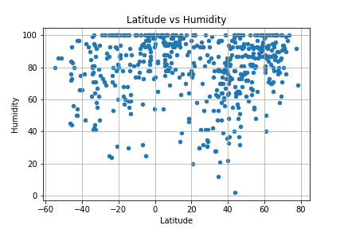
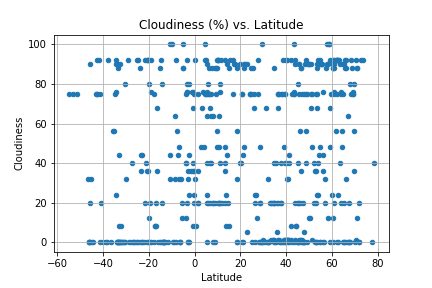
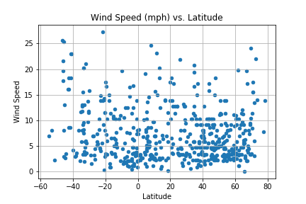

# WEATHER PY

## Temperature Trends 
- The highest temperatures are between the latitudes 20 and 40, the behavior is not symmetric when comparing with between -20 and -40. This is a bit different to the expected result of temperature being high between 0 and 20.
- For cities, at the same latitude, the temperature seems to be low for cities that have higher percentage of humidity.
- There seems to be no correlation between either Cloudiness or wind speed and the city temperatures. 


```python
# Dependencies and Setup
import matplotlib.pyplot as plt
import pandas as pd
import numpy as np
import requests
import time

# Import API key
import api_keys

# Incorporated citipy to determine city based on latitude and longitude
from citipy import citipy

# Output File (CSV)
output_data_file = "output_data/cities.csv"

# Range of latitudes and longitudes
lat_range = (-90, 90)
lng_range = (-180, 180)
```

## Generate Cities List


```python
# List for holding lat_lngs and cities
lat_lngs = []
cities = []

# Create a set of random lat and lng combinations
lats = np.random.uniform(low=-90.000, high=90.000, size=1500)
lngs = np.random.uniform(low=-180.000, high=180.000, size=1500)
lat_lngs = zip(lats, lngs)

# Identify nearest city for each lat, lng combination
for lat_lng in lat_lngs:
    city = citipy.nearest_city(lat_lng[0], lat_lng[1]).city_name
    
    # If the city is unique, then add it to a our cities list
    if city not in cities:
        cities.append(city)

# Print the city count to confirm sufficient count
len(cities)
```


    604


## Perform API Calls


```python
# OpenWeatherMap API Key
api_key = api_keys.api_key

# Starting URL for Weather Map API Call
url = "http://api.openweathermap.org/data/2.5/weather?units=Imperial&APPID=" + api_key 
city_data = []

# Print to logger
print("Beginning Data Retrieval     ")
print("-----------------------------")

for city in cities:
    city_url = url + "&q=" + city
    print(city_url)
    try:
        city_weather = requests.get(city_url).json()
        city_lat = city_weather['coord']['lat']
        city_mtemp = city_weather['main']['temp_max']
        city_humidity = city_weather['main']['humidity']
        city_cloudiness = city_weather['clouds']['all']
        city_wspeed = city_weather['wind']['speed']
        city_data.append({"city":city,
                      "Latitude":city_lat,
                      "Max Temp":city_mtemp,
                      "Humidity":city_humidity,
                      "Cloudiness":city_cloudiness,
                      "Wind Speed":city_wspeed,
                      })
    except:
        print("city not found")
        pass

# Indicate that Data Loading is complete 
print("Data Retrieval Complete  ")

    
    
    


```

    Beginning Data Retrieval     
    -----------------------------
    http://api.openweathermap.org/data/2.5/weather?units=Imperial&APPID=8e7985f09aa3bf830ab2d84bfc3dd5dc&q=nosy varika
    http://api.openweathermap.org/data/2.5/weather?units=Imperial&APPID=8e7985f09aa3bf830ab2d84bfc3dd5dc&q=zambezi
    http://api.openweathermap.org/data/2.5/weather?units=Imperial&APPID=8e7985f09aa3bf830ab2d84bfc3dd5dc&q=tiksi
    http://api.openweathermap.org/data/2.5/weather?units=Imperial&APPID=8e7985f09aa3bf830ab2d84bfc3dd5dc&q=punta arenas
    http://api.openweathermap.org/data/2.5/weather?units=Imperial&APPID=8e7985f09aa3bf830ab2d84bfc3dd5dc&q=bredasdorp
    http://api.openweathermap.org/data/2.5/weather?units=Imperial&APPID=8e7985f09aa3bf830ab2d84bfc3dd5dc&q=barrow
    http://api.openweathermap.org/data/2.5/weather?units=Imperial&APPID=8e7985f09aa3bf830ab2d84bfc3dd5dc&q=petropavlovsk-kamchatskiy
    http://api.openweathermap.org/data/2.5/weather?units=Imperial&APPID=8e7985f09aa3bf830ab2d84bfc3dd5dc&q=barbar
    city not found
    http://api.openweathermap.org/data/2.5/weather?units=Imperial&APPID=8e7985f09aa3bf830ab2d84bfc3dd5dc&q=corovode
    http://api.openweathermap.org/data/2.5/weather?units=Imperial&APPID=8e7985f09aa3bf830ab2d84bfc3dd5dc&q=port alfred
    http://api.openweathermap.org/data/2.5/weather?units=Imperial&APPID=8e7985f09aa3bf830ab2d84bfc3dd5dc&q=ribeira grande
    http://api.openweathermap.org/data/2.5/weather?units=Imperial&APPID=8e7985f09aa3bf830ab2d84bfc3dd5dc&q=san juan
    http://api.openweathermap.org/data/2.5/weather?units=Imperial&APPID=8e7985f09aa3bf830ab2d84bfc3dd5dc&q=piritiba
    http://api.openweathermap.org/data/2.5/weather?units=Imperial&APPID=8e7985f09aa3bf830ab2d84bfc3dd5dc&q=oum hadjer
    http://api.openweathermap.org/data/2.5/weather?units=Imperial&APPID=8e7985f09aa3bf830ab2d84bfc3dd5dc&q=ust-barguzin
    http://api.openweathermap.org/data/2.5/weather?units=Imperial&APPID=8e7985f09aa3bf830ab2d84bfc3dd5dc&q=eirunepe
    http://api.openweathermap.org/data/2.5/weather?units=Imperial&APPID=8e7985f09aa3bf830ab2d84bfc3dd5dc&q=cape town
    http://api.openweathermap.org/data/2.5/weather?units=Imperial&APPID=8e7985f09aa3bf830ab2d84bfc3dd5dc&q=talcahuano
    http://api.openweathermap.org/data/2.5/weather?units=Imperial&APPID=8e7985f09aa3bf830ab2d84bfc3dd5dc&q=yellowknife
    http://api.openweathermap.org/data/2.5/weather?units=Imperial&APPID=8e7985f09aa3bf830ab2d84bfc3dd5dc&q=ushuaia
    http://api.openweathermap.org/data/2.5/weather?units=Imperial&APPID=8e7985f09aa3bf830ab2d84bfc3dd5dc&q=upernavik
    http://api.openweathermap.org/data/2.5/weather?units=Imperial&APPID=8e7985f09aa3bf830ab2d84bfc3dd5dc&q=buraydah
    http://api.openweathermap.org/data/2.5/weather?units=Imperial&APPID=8e7985f09aa3bf830ab2d84bfc3dd5dc&q=glendive
    http://api.openweathermap.org/data/2.5/weather?units=Imperial&APPID=8e7985f09aa3bf830ab2d84bfc3dd5dc&q=torbay
    http://api.openweathermap.org/data/2.5/weather?units=Imperial&APPID=8e7985f09aa3bf830ab2d84bfc3dd5dc&q=rikitea
    http://api.openweathermap.org/data/2.5/weather?units=Imperial&APPID=8e7985f09aa3bf830ab2d84bfc3dd5dc&q=cayenne
    http://api.openweathermap.org/data/2.5/weather?units=Imperial&APPID=8e7985f09aa3bf830ab2d84bfc3dd5dc&q=suntar
    http://api.openweathermap.org/data/2.5/weather?units=Imperial&APPID=8e7985f09aa3bf830ab2d84bfc3dd5dc&q=mataura
    http://api.openweathermap.org/data/2.5/weather?units=Imperial&APPID=8e7985f09aa3bf830ab2d84bfc3dd5dc&q=leningradskiy
    http://api.openweathermap.org/data/2.5/weather?units=Imperial&APPID=8e7985f09aa3bf830ab2d84bfc3dd5dc&q=jamestown
    http://api.openweathermap.org/data/2.5/weather?units=Imperial&APPID=8e7985f09aa3bf830ab2d84bfc3dd5dc&q=de aar
    http://api.openweathermap.org/data/2.5/weather?units=Imperial&APPID=8e7985f09aa3bf830ab2d84bfc3dd5dc&q=marrakesh
    http://api.openweathermap.org/data/2.5/weather?units=Imperial&APPID=8e7985f09aa3bf830ab2d84bfc3dd5dc&q=andijon
    http://api.openweathermap.org/data/2.5/weather?units=Imperial&APPID=8e7985f09aa3bf830ab2d84bfc3dd5dc&q=east london
    http://api.openweathermap.org/data/2.5/weather?units=Imperial&APPID=8e7985f09aa3bf830ab2d84bfc3dd5dc&q=pisco
    http://api.openweathermap.org/data/2.5/weather?units=Imperial&APPID=8e7985f09aa3bf830ab2d84bfc3dd5dc&q=saldanha
    http://api.openweathermap.org/data/2.5/weather?units=Imperial&APPID=8e7985f09aa3bf830ab2d84bfc3dd5dc&q=mehamn
    http://api.openweathermap.org/data/2.5/weather?units=Imperial&APPID=8e7985f09aa3bf830ab2d84bfc3dd5dc&q=hobart
    http://api.openweathermap.org/data/2.5/weather?units=Imperial&APPID=8e7985f09aa3bf830ab2d84bfc3dd5dc&q=otawara
    http://api.openweathermap.org/data/2.5/weather?units=Imperial&APPID=8e7985f09aa3bf830ab2d84bfc3dd5dc&q=paamiut
    http://api.openweathermap.org/data/2.5/weather?units=Imperial&APPID=8e7985f09aa3bf830ab2d84bfc3dd5dc&q=jutogh
    http://api.openweathermap.org/data/2.5/weather?units=Imperial&APPID=8e7985f09aa3bf830ab2d84bfc3dd5dc&q=ulaanbaatar
    http://api.openweathermap.org/data/2.5/weather?units=Imperial&APPID=8e7985f09aa3bf830ab2d84bfc3dd5dc&q=hilo
    http://api.openweathermap.org/data/2.5/weather?units=Imperial&APPID=8e7985f09aa3bf830ab2d84bfc3dd5dc&q=barentsburg
    city not found
    http://api.openweathermap.org/data/2.5/weather?units=Imperial&APPID=8e7985f09aa3bf830ab2d84bfc3dd5dc&q=iqaluit
    http://api.openweathermap.org/data/2.5/weather?units=Imperial&APPID=8e7985f09aa3bf830ab2d84bfc3dd5dc&q=kjollefjord
    http://api.openweathermap.org/data/2.5/weather?units=Imperial&APPID=8e7985f09aa3bf830ab2d84bfc3dd5dc&q=los banos
    http://api.openweathermap.org/data/2.5/weather?units=Imperial&APPID=8e7985f09aa3bf830ab2d84bfc3dd5dc&q=busselton
    http://api.openweathermap.org/data/2.5/weather?units=Imperial&APPID=8e7985f09aa3bf830ab2d84bfc3dd5dc&q=mahebourg
    http://api.openweathermap.org/data/2.5/weather?units=Imperial&APPID=8e7985f09aa3bf830ab2d84bfc3dd5dc&q=chumikan
    http://api.openweathermap.org/data/2.5/weather?units=Imperial&APPID=8e7985f09aa3bf830ab2d84bfc3dd5dc&q=tutoia
    http://api.openweathermap.org/data/2.5/weather?units=Imperial&APPID=8e7985f09aa3bf830ab2d84bfc3dd5dc&q=kloulklubed
    http://api.openweathermap.org/data/2.5/weather?units=Imperial&APPID=8e7985f09aa3bf830ab2d84bfc3dd5dc&q=havelock
    http://api.openweathermap.org/data/2.5/weather?units=Imperial&APPID=8e7985f09aa3bf830ab2d84bfc3dd5dc&q=karaul
    city not found
    http://api.openweathermap.org/data/2.5/weather?units=Imperial&APPID=8e7985f09aa3bf830ab2d84bfc3dd5dc&q=zhezkazgan
    http://api.openweathermap.org/data/2.5/weather?units=Imperial&APPID=8e7985f09aa3bf830ab2d84bfc3dd5dc&q=fort morgan
    http://api.openweathermap.org/data/2.5/weather?units=Imperial&APPID=8e7985f09aa3bf830ab2d84bfc3dd5dc&q=marsaxlokk
    http://api.openweathermap.org/data/2.5/weather?units=Imperial&APPID=8e7985f09aa3bf830ab2d84bfc3dd5dc&q=geraldton
    http://api.openweathermap.org/data/2.5/weather?units=Imperial&APPID=8e7985f09aa3bf830ab2d84bfc3dd5dc&q=faanui
    http://api.openweathermap.org/data/2.5/weather?units=Imperial&APPID=8e7985f09aa3bf830ab2d84bfc3dd5dc&q=puerto ayora
    http://api.openweathermap.org/data/2.5/weather?units=Imperial&APPID=8e7985f09aa3bf830ab2d84bfc3dd5dc&q=ruidoso
    http://api.openweathermap.org/data/2.5/weather?units=Imperial&APPID=8e7985f09aa3bf830ab2d84bfc3dd5dc&q=carnarvon
    http://api.openweathermap.org/data/2.5/weather?units=Imperial&APPID=8e7985f09aa3bf830ab2d84bfc3dd5dc&q=hermanus
    http://api.openweathermap.org/data/2.5/weather?units=Imperial&APPID=8e7985f09aa3bf830ab2d84bfc3dd5dc&q=severo-kurilsk
    http://api.openweathermap.org/data/2.5/weather?units=Imperial&APPID=8e7985f09aa3bf830ab2d84bfc3dd5dc&q=hithadhoo
    http://api.openweathermap.org/data/2.5/weather?units=Imperial&APPID=8e7985f09aa3bf830ab2d84bfc3dd5dc&q=pevek
    http://api.openweathermap.org/data/2.5/weather?units=Imperial&APPID=8e7985f09aa3bf830ab2d84bfc3dd5dc&q=sao joao da barra
    http://api.openweathermap.org/data/2.5/weather?units=Imperial&APPID=8e7985f09aa3bf830ab2d84bfc3dd5dc&q=nizhneyansk
    city not found
    http://api.openweathermap.org/data/2.5/weather?units=Imperial&APPID=8e7985f09aa3bf830ab2d84bfc3dd5dc&q=cidreira
    http://api.openweathermap.org/data/2.5/weather?units=Imperial&APPID=8e7985f09aa3bf830ab2d84bfc3dd5dc&q=new norfolk
    http://api.openweathermap.org/data/2.5/weather?units=Imperial&APPID=8e7985f09aa3bf830ab2d84bfc3dd5dc&q=lebu
    http://api.openweathermap.org/data/2.5/weather?units=Imperial&APPID=8e7985f09aa3bf830ab2d84bfc3dd5dc&q=kapaa
    http://api.openweathermap.org/data/2.5/weather?units=Imperial&APPID=8e7985f09aa3bf830ab2d84bfc3dd5dc&q=kaitangata
    http://api.openweathermap.org/data/2.5/weather?units=Imperial&APPID=8e7985f09aa3bf830ab2d84bfc3dd5dc&q=wanning
    http://api.openweathermap.org/data/2.5/weather?units=Imperial&APPID=8e7985f09aa3bf830ab2d84bfc3dd5dc&q=tumannyy
    city not found
    http://api.openweathermap.org/data/2.5/weather?units=Imperial&APPID=8e7985f09aa3bf830ab2d84bfc3dd5dc&q=yanam
    http://api.openweathermap.org/data/2.5/weather?units=Imperial&APPID=8e7985f09aa3bf830ab2d84bfc3dd5dc&q=pameungpeuk
    http://api.openweathermap.org/data/2.5/weather?units=Imperial&APPID=8e7985f09aa3bf830ab2d84bfc3dd5dc&q=nouadhibou
    http://api.openweathermap.org/data/2.5/weather?units=Imperial&APPID=8e7985f09aa3bf830ab2d84bfc3dd5dc&q=santa eulalia del rio
    city not found
    http://api.openweathermap.org/data/2.5/weather?units=Imperial&APPID=8e7985f09aa3bf830ab2d84bfc3dd5dc&q=attawapiskat
    city not found
    http://api.openweathermap.org/data/2.5/weather?units=Imperial&APPID=8e7985f09aa3bf830ab2d84bfc3dd5dc&q=illoqqortoormiut
    city not found
    http://api.openweathermap.org/data/2.5/weather?units=Imperial&APPID=8e7985f09aa3bf830ab2d84bfc3dd5dc&q=yar-sale
    http://api.openweathermap.org/data/2.5/weather?units=Imperial&APPID=8e7985f09aa3bf830ab2d84bfc3dd5dc&q=chokurdakh
    http://api.openweathermap.org/data/2.5/weather?units=Imperial&APPID=8e7985f09aa3bf830ab2d84bfc3dd5dc&q=kodiak
    http://api.openweathermap.org/data/2.5/weather?units=Imperial&APPID=8e7985f09aa3bf830ab2d84bfc3dd5dc&q=mutis
    http://api.openweathermap.org/data/2.5/weather?units=Imperial&APPID=8e7985f09aa3bf830ab2d84bfc3dd5dc&q=butaritari
    http://api.openweathermap.org/data/2.5/weather?units=Imperial&APPID=8e7985f09aa3bf830ab2d84bfc3dd5dc&q=oksovskiy
    http://api.openweathermap.org/data/2.5/weather?units=Imperial&APPID=8e7985f09aa3bf830ab2d84bfc3dd5dc&q=chuy
    http://api.openweathermap.org/data/2.5/weather?units=Imperial&APPID=8e7985f09aa3bf830ab2d84bfc3dd5dc&q=taolanaro
    city not found
    http://api.openweathermap.org/data/2.5/weather?units=Imperial&APPID=8e7985f09aa3bf830ab2d84bfc3dd5dc&q=vaini
    http://api.openweathermap.org/data/2.5/weather?units=Imperial&APPID=8e7985f09aa3bf830ab2d84bfc3dd5dc&q=saskylakh
    http://api.openweathermap.org/data/2.5/weather?units=Imperial&APPID=8e7985f09aa3bf830ab2d84bfc3dd5dc&q=nikolskoye
    http://api.openweathermap.org/data/2.5/weather?units=Imperial&APPID=8e7985f09aa3bf830ab2d84bfc3dd5dc&q=brae
    http://api.openweathermap.org/data/2.5/weather?units=Imperial&APPID=8e7985f09aa3bf830ab2d84bfc3dd5dc&q=grindavik
    http://api.openweathermap.org/data/2.5/weather?units=Imperial&APPID=8e7985f09aa3bf830ab2d84bfc3dd5dc&q=tautira
    http://api.openweathermap.org/data/2.5/weather?units=Imperial&APPID=8e7985f09aa3bf830ab2d84bfc3dd5dc&q=haibowan
    city not found
    http://api.openweathermap.org/data/2.5/weather?units=Imperial&APPID=8e7985f09aa3bf830ab2d84bfc3dd5dc&q=saleaula
    city not found
    http://api.openweathermap.org/data/2.5/weather?units=Imperial&APPID=8e7985f09aa3bf830ab2d84bfc3dd5dc&q=castro
    http://api.openweathermap.org/data/2.5/weather?units=Imperial&APPID=8e7985f09aa3bf830ab2d84bfc3dd5dc&q=belyy yar
    http://api.openweathermap.org/data/2.5/weather?units=Imperial&APPID=8e7985f09aa3bf830ab2d84bfc3dd5dc&q=ancud
    http://api.openweathermap.org/data/2.5/weather?units=Imperial&APPID=8e7985f09aa3bf830ab2d84bfc3dd5dc&q=teya
    http://api.openweathermap.org/data/2.5/weather?units=Imperial&APPID=8e7985f09aa3bf830ab2d84bfc3dd5dc&q=codrington
    http://api.openweathermap.org/data/2.5/weather?units=Imperial&APPID=8e7985f09aa3bf830ab2d84bfc3dd5dc&q=bathsheba
    http://api.openweathermap.org/data/2.5/weather?units=Imperial&APPID=8e7985f09aa3bf830ab2d84bfc3dd5dc&q=port hardy
    http://api.openweathermap.org/data/2.5/weather?units=Imperial&APPID=8e7985f09aa3bf830ab2d84bfc3dd5dc&q=diego de almagro
    http://api.openweathermap.org/data/2.5/weather?units=Imperial&APPID=8e7985f09aa3bf830ab2d84bfc3dd5dc&q=ixtapa
    http://api.openweathermap.org/data/2.5/weather?units=Imperial&APPID=8e7985f09aa3bf830ab2d84bfc3dd5dc&q=aksu
    http://api.openweathermap.org/data/2.5/weather?units=Imperial&APPID=8e7985f09aa3bf830ab2d84bfc3dd5dc&q=college
    http://api.openweathermap.org/data/2.5/weather?units=Imperial&APPID=8e7985f09aa3bf830ab2d84bfc3dd5dc&q=esperance
    http://api.openweathermap.org/data/2.5/weather?units=Imperial&APPID=8e7985f09aa3bf830ab2d84bfc3dd5dc&q=vanavara
    http://api.openweathermap.org/data/2.5/weather?units=Imperial&APPID=8e7985f09aa3bf830ab2d84bfc3dd5dc&q=sentyabrskiy
    city not found
    http://api.openweathermap.org/data/2.5/weather?units=Imperial&APPID=8e7985f09aa3bf830ab2d84bfc3dd5dc&q=enid
    http://api.openweathermap.org/data/2.5/weather?units=Imperial&APPID=8e7985f09aa3bf830ab2d84bfc3dd5dc&q=adre
    http://api.openweathermap.org/data/2.5/weather?units=Imperial&APPID=8e7985f09aa3bf830ab2d84bfc3dd5dc&q=tasiilaq
    http://api.openweathermap.org/data/2.5/weather?units=Imperial&APPID=8e7985f09aa3bf830ab2d84bfc3dd5dc&q=clyde river
    http://api.openweathermap.org/data/2.5/weather?units=Imperial&APPID=8e7985f09aa3bf830ab2d84bfc3dd5dc&q=bentiu
    city not found
    http://api.openweathermap.org/data/2.5/weather?units=Imperial&APPID=8e7985f09aa3bf830ab2d84bfc3dd5dc&q=bluff
    http://api.openweathermap.org/data/2.5/weather?units=Imperial&APPID=8e7985f09aa3bf830ab2d84bfc3dd5dc&q=takoradi
    http://api.openweathermap.org/data/2.5/weather?units=Imperial&APPID=8e7985f09aa3bf830ab2d84bfc3dd5dc&q=sinnamary
    http://api.openweathermap.org/data/2.5/weather?units=Imperial&APPID=8e7985f09aa3bf830ab2d84bfc3dd5dc&q=belushya guba
    city not found
    http://api.openweathermap.org/data/2.5/weather?units=Imperial&APPID=8e7985f09aa3bf830ab2d84bfc3dd5dc&q=saint-philippe
    http://api.openweathermap.org/data/2.5/weather?units=Imperial&APPID=8e7985f09aa3bf830ab2d84bfc3dd5dc&q=mar del plata
    http://api.openweathermap.org/data/2.5/weather?units=Imperial&APPID=8e7985f09aa3bf830ab2d84bfc3dd5dc&q=airai
    http://api.openweathermap.org/data/2.5/weather?units=Imperial&APPID=8e7985f09aa3bf830ab2d84bfc3dd5dc&q=maniitsoq
    http://api.openweathermap.org/data/2.5/weather?units=Imperial&APPID=8e7985f09aa3bf830ab2d84bfc3dd5dc&q=panguna
    http://api.openweathermap.org/data/2.5/weather?units=Imperial&APPID=8e7985f09aa3bf830ab2d84bfc3dd5dc&q=port blair
    http://api.openweathermap.org/data/2.5/weather?units=Imperial&APPID=8e7985f09aa3bf830ab2d84bfc3dd5dc&q=atuona
    http://api.openweathermap.org/data/2.5/weather?units=Imperial&APPID=8e7985f09aa3bf830ab2d84bfc3dd5dc&q=point pedro
    http://api.openweathermap.org/data/2.5/weather?units=Imperial&APPID=8e7985f09aa3bf830ab2d84bfc3dd5dc&q=tuktoyaktuk
    http://api.openweathermap.org/data/2.5/weather?units=Imperial&APPID=8e7985f09aa3bf830ab2d84bfc3dd5dc&q=narrabri
    http://api.openweathermap.org/data/2.5/weather?units=Imperial&APPID=8e7985f09aa3bf830ab2d84bfc3dd5dc&q=amderma
    city not found
    http://api.openweathermap.org/data/2.5/weather?units=Imperial&APPID=8e7985f09aa3bf830ab2d84bfc3dd5dc&q=karpenision
    city not found
    http://api.openweathermap.org/data/2.5/weather?units=Imperial&APPID=8e7985f09aa3bf830ab2d84bfc3dd5dc&q=kankan
    http://api.openweathermap.org/data/2.5/weather?units=Imperial&APPID=8e7985f09aa3bf830ab2d84bfc3dd5dc&q=san quintin
    http://api.openweathermap.org/data/2.5/weather?units=Imperial&APPID=8e7985f09aa3bf830ab2d84bfc3dd5dc&q=manado
    http://api.openweathermap.org/data/2.5/weather?units=Imperial&APPID=8e7985f09aa3bf830ab2d84bfc3dd5dc&q=manadhoo
    http://api.openweathermap.org/data/2.5/weather?units=Imperial&APPID=8e7985f09aa3bf830ab2d84bfc3dd5dc&q=nizhniy kuranakh
    http://api.openweathermap.org/data/2.5/weather?units=Imperial&APPID=8e7985f09aa3bf830ab2d84bfc3dd5dc&q=marzuq
    http://api.openweathermap.org/data/2.5/weather?units=Imperial&APPID=8e7985f09aa3bf830ab2d84bfc3dd5dc&q=victorville
    http://api.openweathermap.org/data/2.5/weather?units=Imperial&APPID=8e7985f09aa3bf830ab2d84bfc3dd5dc&q=tarabuco
    http://api.openweathermap.org/data/2.5/weather?units=Imperial&APPID=8e7985f09aa3bf830ab2d84bfc3dd5dc&q=westport
    http://api.openweathermap.org/data/2.5/weather?units=Imperial&APPID=8e7985f09aa3bf830ab2d84bfc3dd5dc&q=avarua
    http://api.openweathermap.org/data/2.5/weather?units=Imperial&APPID=8e7985f09aa3bf830ab2d84bfc3dd5dc&q=poso
    http://api.openweathermap.org/data/2.5/weather?units=Imperial&APPID=8e7985f09aa3bf830ab2d84bfc3dd5dc&q=port elizabeth
    http://api.openweathermap.org/data/2.5/weather?units=Imperial&APPID=8e7985f09aa3bf830ab2d84bfc3dd5dc&q=saint george
    http://api.openweathermap.org/data/2.5/weather?units=Imperial&APPID=8e7985f09aa3bf830ab2d84bfc3dd5dc&q=pedernales
    http://api.openweathermap.org/data/2.5/weather?units=Imperial&APPID=8e7985f09aa3bf830ab2d84bfc3dd5dc&q=payson
    http://api.openweathermap.org/data/2.5/weather?units=Imperial&APPID=8e7985f09aa3bf830ab2d84bfc3dd5dc&q=revelstoke
    http://api.openweathermap.org/data/2.5/weather?units=Imperial&APPID=8e7985f09aa3bf830ab2d84bfc3dd5dc&q=bengkulu
    city not found
    http://api.openweathermap.org/data/2.5/weather?units=Imperial&APPID=8e7985f09aa3bf830ab2d84bfc3dd5dc&q=hanyang
    http://api.openweathermap.org/data/2.5/weather?units=Imperial&APPID=8e7985f09aa3bf830ab2d84bfc3dd5dc&q=sept-iles
    http://api.openweathermap.org/data/2.5/weather?units=Imperial&APPID=8e7985f09aa3bf830ab2d84bfc3dd5dc&q=tateyama
    http://api.openweathermap.org/data/2.5/weather?units=Imperial&APPID=8e7985f09aa3bf830ab2d84bfc3dd5dc&q=los angeles
    http://api.openweathermap.org/data/2.5/weather?units=Imperial&APPID=8e7985f09aa3bf830ab2d84bfc3dd5dc&q=namatanai
    http://api.openweathermap.org/data/2.5/weather?units=Imperial&APPID=8e7985f09aa3bf830ab2d84bfc3dd5dc&q=albany
    http://api.openweathermap.org/data/2.5/weather?units=Imperial&APPID=8e7985f09aa3bf830ab2d84bfc3dd5dc&q=kruisfontein
    http://api.openweathermap.org/data/2.5/weather?units=Imperial&APPID=8e7985f09aa3bf830ab2d84bfc3dd5dc&q=dikson
    http://api.openweathermap.org/data/2.5/weather?units=Imperial&APPID=8e7985f09aa3bf830ab2d84bfc3dd5dc&q=guatape
    http://api.openweathermap.org/data/2.5/weather?units=Imperial&APPID=8e7985f09aa3bf830ab2d84bfc3dd5dc&q=narsaq
    http://api.openweathermap.org/data/2.5/weather?units=Imperial&APPID=8e7985f09aa3bf830ab2d84bfc3dd5dc&q=eyl
    http://api.openweathermap.org/data/2.5/weather?units=Imperial&APPID=8e7985f09aa3bf830ab2d84bfc3dd5dc&q=sao filipe
    http://api.openweathermap.org/data/2.5/weather?units=Imperial&APPID=8e7985f09aa3bf830ab2d84bfc3dd5dc&q=rio gallegos
    http://api.openweathermap.org/data/2.5/weather?units=Imperial&APPID=8e7985f09aa3bf830ab2d84bfc3dd5dc&q=kulhudhuffushi
    http://api.openweathermap.org/data/2.5/weather?units=Imperial&APPID=8e7985f09aa3bf830ab2d84bfc3dd5dc&q=arraial do cabo
    http://api.openweathermap.org/data/2.5/weather?units=Imperial&APPID=8e7985f09aa3bf830ab2d84bfc3dd5dc&q=mackenzie
    http://api.openweathermap.org/data/2.5/weather?units=Imperial&APPID=8e7985f09aa3bf830ab2d84bfc3dd5dc&q=bambanglipuro
    http://api.openweathermap.org/data/2.5/weather?units=Imperial&APPID=8e7985f09aa3bf830ab2d84bfc3dd5dc&q=victoria
    http://api.openweathermap.org/data/2.5/weather?units=Imperial&APPID=8e7985f09aa3bf830ab2d84bfc3dd5dc&q=kieta
    http://api.openweathermap.org/data/2.5/weather?units=Imperial&APPID=8e7985f09aa3bf830ab2d84bfc3dd5dc&q=juneau
    http://api.openweathermap.org/data/2.5/weather?units=Imperial&APPID=8e7985f09aa3bf830ab2d84bfc3dd5dc&q=kavieng
    http://api.openweathermap.org/data/2.5/weather?units=Imperial&APPID=8e7985f09aa3bf830ab2d84bfc3dd5dc&q=hamilton
    http://api.openweathermap.org/data/2.5/weather?units=Imperial&APPID=8e7985f09aa3bf830ab2d84bfc3dd5dc&q=accra
    http://api.openweathermap.org/data/2.5/weather?units=Imperial&APPID=8e7985f09aa3bf830ab2d84bfc3dd5dc&q=puerto colombia
    http://api.openweathermap.org/data/2.5/weather?units=Imperial&APPID=8e7985f09aa3bf830ab2d84bfc3dd5dc&q=yulara
    http://api.openweathermap.org/data/2.5/weather?units=Imperial&APPID=8e7985f09aa3bf830ab2d84bfc3dd5dc&q=saint augustine
    http://api.openweathermap.org/data/2.5/weather?units=Imperial&APPID=8e7985f09aa3bf830ab2d84bfc3dd5dc&q=rungata
    city not found
    http://api.openweathermap.org/data/2.5/weather?units=Imperial&APPID=8e7985f09aa3bf830ab2d84bfc3dd5dc&q=kedrovyy
    http://api.openweathermap.org/data/2.5/weather?units=Imperial&APPID=8e7985f09aa3bf830ab2d84bfc3dd5dc&q=palabuhanratu
    city not found
    http://api.openweathermap.org/data/2.5/weather?units=Imperial&APPID=8e7985f09aa3bf830ab2d84bfc3dd5dc&q=saint anthony
    http://api.openweathermap.org/data/2.5/weather?units=Imperial&APPID=8e7985f09aa3bf830ab2d84bfc3dd5dc&q=namibe
    http://api.openweathermap.org/data/2.5/weather?units=Imperial&APPID=8e7985f09aa3bf830ab2d84bfc3dd5dc&q=losone
    http://api.openweathermap.org/data/2.5/weather?units=Imperial&APPID=8e7985f09aa3bf830ab2d84bfc3dd5dc&q=port shepstone
    http://api.openweathermap.org/data/2.5/weather?units=Imperial&APPID=8e7985f09aa3bf830ab2d84bfc3dd5dc&q=provideniya
    http://api.openweathermap.org/data/2.5/weather?units=Imperial&APPID=8e7985f09aa3bf830ab2d84bfc3dd5dc&q=constitucion
    http://api.openweathermap.org/data/2.5/weather?units=Imperial&APPID=8e7985f09aa3bf830ab2d84bfc3dd5dc&q=mo i rana
    http://api.openweathermap.org/data/2.5/weather?units=Imperial&APPID=8e7985f09aa3bf830ab2d84bfc3dd5dc&q=guerrero negro
    http://api.openweathermap.org/data/2.5/weather?units=Imperial&APPID=8e7985f09aa3bf830ab2d84bfc3dd5dc&q=santa vitoria do palmar
    http://api.openweathermap.org/data/2.5/weather?units=Imperial&APPID=8e7985f09aa3bf830ab2d84bfc3dd5dc&q=bambous virieux
    http://api.openweathermap.org/data/2.5/weather?units=Imperial&APPID=8e7985f09aa3bf830ab2d84bfc3dd5dc&q=guisa
    http://api.openweathermap.org/data/2.5/weather?units=Imperial&APPID=8e7985f09aa3bf830ab2d84bfc3dd5dc&q=pangnirtung
    http://api.openweathermap.org/data/2.5/weather?units=Imperial&APPID=8e7985f09aa3bf830ab2d84bfc3dd5dc&q=ponta do sol
    http://api.openweathermap.org/data/2.5/weather?units=Imperial&APPID=8e7985f09aa3bf830ab2d84bfc3dd5dc&q=norman wells
    http://api.openweathermap.org/data/2.5/weather?units=Imperial&APPID=8e7985f09aa3bf830ab2d84bfc3dd5dc&q=waddan
    http://api.openweathermap.org/data/2.5/weather?units=Imperial&APPID=8e7985f09aa3bf830ab2d84bfc3dd5dc&q=grand gaube
    http://api.openweathermap.org/data/2.5/weather?units=Imperial&APPID=8e7985f09aa3bf830ab2d84bfc3dd5dc&q=anadyr
    http://api.openweathermap.org/data/2.5/weather?units=Imperial&APPID=8e7985f09aa3bf830ab2d84bfc3dd5dc&q=florianopolis
    http://api.openweathermap.org/data/2.5/weather?units=Imperial&APPID=8e7985f09aa3bf830ab2d84bfc3dd5dc&q=thompson
    http://api.openweathermap.org/data/2.5/weather?units=Imperial&APPID=8e7985f09aa3bf830ab2d84bfc3dd5dc&q=zhangye
    http://api.openweathermap.org/data/2.5/weather?units=Imperial&APPID=8e7985f09aa3bf830ab2d84bfc3dd5dc&q=mareeba
    http://api.openweathermap.org/data/2.5/weather?units=Imperial&APPID=8e7985f09aa3bf830ab2d84bfc3dd5dc&q=alofi
    http://api.openweathermap.org/data/2.5/weather?units=Imperial&APPID=8e7985f09aa3bf830ab2d84bfc3dd5dc&q=ibb
    http://api.openweathermap.org/data/2.5/weather?units=Imperial&APPID=8e7985f09aa3bf830ab2d84bfc3dd5dc&q=ust-kuyga
    http://api.openweathermap.org/data/2.5/weather?units=Imperial&APPID=8e7985f09aa3bf830ab2d84bfc3dd5dc&q=salalah
    http://api.openweathermap.org/data/2.5/weather?units=Imperial&APPID=8e7985f09aa3bf830ab2d84bfc3dd5dc&q=lodja
    http://api.openweathermap.org/data/2.5/weather?units=Imperial&APPID=8e7985f09aa3bf830ab2d84bfc3dd5dc&q=asau
    city not found
    http://api.openweathermap.org/data/2.5/weather?units=Imperial&APPID=8e7985f09aa3bf830ab2d84bfc3dd5dc&q=tsihombe
    city not found
    http://api.openweathermap.org/data/2.5/weather?units=Imperial&APPID=8e7985f09aa3bf830ab2d84bfc3dd5dc&q=krasnokamsk
    http://api.openweathermap.org/data/2.5/weather?units=Imperial&APPID=8e7985f09aa3bf830ab2d84bfc3dd5dc&q=emerald
    http://api.openweathermap.org/data/2.5/weather?units=Imperial&APPID=8e7985f09aa3bf830ab2d84bfc3dd5dc&q=kahului
    http://api.openweathermap.org/data/2.5/weather?units=Imperial&APPID=8e7985f09aa3bf830ab2d84bfc3dd5dc&q=voh
    http://api.openweathermap.org/data/2.5/weather?units=Imperial&APPID=8e7985f09aa3bf830ab2d84bfc3dd5dc&q=monrovia
    http://api.openweathermap.org/data/2.5/weather?units=Imperial&APPID=8e7985f09aa3bf830ab2d84bfc3dd5dc&q=halalo
    city not found
    http://api.openweathermap.org/data/2.5/weather?units=Imperial&APPID=8e7985f09aa3bf830ab2d84bfc3dd5dc&q=birin
    http://api.openweathermap.org/data/2.5/weather?units=Imperial&APPID=8e7985f09aa3bf830ab2d84bfc3dd5dc&q=vestmanna
    http://api.openweathermap.org/data/2.5/weather?units=Imperial&APPID=8e7985f09aa3bf830ab2d84bfc3dd5dc&q=alto longa
    http://api.openweathermap.org/data/2.5/weather?units=Imperial&APPID=8e7985f09aa3bf830ab2d84bfc3dd5dc&q=kargasok
    http://api.openweathermap.org/data/2.5/weather?units=Imperial&APPID=8e7985f09aa3bf830ab2d84bfc3dd5dc&q=bacuit
    city not found
    http://api.openweathermap.org/data/2.5/weather?units=Imperial&APPID=8e7985f09aa3bf830ab2d84bfc3dd5dc&q=nanortalik
    http://api.openweathermap.org/data/2.5/weather?units=Imperial&APPID=8e7985f09aa3bf830ab2d84bfc3dd5dc&q=itarema
    http://api.openweathermap.org/data/2.5/weather?units=Imperial&APPID=8e7985f09aa3bf830ab2d84bfc3dd5dc&q=weymouth
    http://api.openweathermap.org/data/2.5/weather?units=Imperial&APPID=8e7985f09aa3bf830ab2d84bfc3dd5dc&q=husavik
    http://api.openweathermap.org/data/2.5/weather?units=Imperial&APPID=8e7985f09aa3bf830ab2d84bfc3dd5dc&q=matagami
    http://api.openweathermap.org/data/2.5/weather?units=Imperial&APPID=8e7985f09aa3bf830ab2d84bfc3dd5dc&q=buala
    http://api.openweathermap.org/data/2.5/weather?units=Imperial&APPID=8e7985f09aa3bf830ab2d84bfc3dd5dc&q=nalut
    http://api.openweathermap.org/data/2.5/weather?units=Imperial&APPID=8e7985f09aa3bf830ab2d84bfc3dd5dc&q=ust-maya
    http://api.openweathermap.org/data/2.5/weather?units=Imperial&APPID=8e7985f09aa3bf830ab2d84bfc3dd5dc&q=malayal
    http://api.openweathermap.org/data/2.5/weather?units=Imperial&APPID=8e7985f09aa3bf830ab2d84bfc3dd5dc&q=talnakh
    http://api.openweathermap.org/data/2.5/weather?units=Imperial&APPID=8e7985f09aa3bf830ab2d84bfc3dd5dc&q=pervomayskoye
    http://api.openweathermap.org/data/2.5/weather?units=Imperial&APPID=8e7985f09aa3bf830ab2d84bfc3dd5dc&q=barlinek
    http://api.openweathermap.org/data/2.5/weather?units=Imperial&APPID=8e7985f09aa3bf830ab2d84bfc3dd5dc&q=mys shmidta
    city not found
    http://api.openweathermap.org/data/2.5/weather?units=Imperial&APPID=8e7985f09aa3bf830ab2d84bfc3dd5dc&q=olafsvik
    city not found
    http://api.openweathermap.org/data/2.5/weather?units=Imperial&APPID=8e7985f09aa3bf830ab2d84bfc3dd5dc&q=tarata
    http://api.openweathermap.org/data/2.5/weather?units=Imperial&APPID=8e7985f09aa3bf830ab2d84bfc3dd5dc&q=sorland
    http://api.openweathermap.org/data/2.5/weather?units=Imperial&APPID=8e7985f09aa3bf830ab2d84bfc3dd5dc&q=kavaratti
    http://api.openweathermap.org/data/2.5/weather?units=Imperial&APPID=8e7985f09aa3bf830ab2d84bfc3dd5dc&q=seregelyes
    http://api.openweathermap.org/data/2.5/weather?units=Imperial&APPID=8e7985f09aa3bf830ab2d84bfc3dd5dc&q=longyearbyen
    http://api.openweathermap.org/data/2.5/weather?units=Imperial&APPID=8e7985f09aa3bf830ab2d84bfc3dd5dc&q=jiuquan
    http://api.openweathermap.org/data/2.5/weather?units=Imperial&APPID=8e7985f09aa3bf830ab2d84bfc3dd5dc&q=samarai
    http://api.openweathermap.org/data/2.5/weather?units=Imperial&APPID=8e7985f09aa3bf830ab2d84bfc3dd5dc&q=ahuimanu
    http://api.openweathermap.org/data/2.5/weather?units=Imperial&APPID=8e7985f09aa3bf830ab2d84bfc3dd5dc&q=salina
    http://api.openweathermap.org/data/2.5/weather?units=Imperial&APPID=8e7985f09aa3bf830ab2d84bfc3dd5dc&q=tarudant
    city not found
    http://api.openweathermap.org/data/2.5/weather?units=Imperial&APPID=8e7985f09aa3bf830ab2d84bfc3dd5dc&q=roald
    http://api.openweathermap.org/data/2.5/weather?units=Imperial&APPID=8e7985f09aa3bf830ab2d84bfc3dd5dc&q=san borja
    http://api.openweathermap.org/data/2.5/weather?units=Imperial&APPID=8e7985f09aa3bf830ab2d84bfc3dd5dc&q=tecoanapa
    http://api.openweathermap.org/data/2.5/weather?units=Imperial&APPID=8e7985f09aa3bf830ab2d84bfc3dd5dc&q=saint-paul
    http://api.openweathermap.org/data/2.5/weather?units=Imperial&APPID=8e7985f09aa3bf830ab2d84bfc3dd5dc&q=jingdezhen
    http://api.openweathermap.org/data/2.5/weather?units=Imperial&APPID=8e7985f09aa3bf830ab2d84bfc3dd5dc&q=terrace
    http://api.openweathermap.org/data/2.5/weather?units=Imperial&APPID=8e7985f09aa3bf830ab2d84bfc3dd5dc&q=batemans bay
    http://api.openweathermap.org/data/2.5/weather?units=Imperial&APPID=8e7985f09aa3bf830ab2d84bfc3dd5dc&q=gigmoto
    http://api.openweathermap.org/data/2.5/weather?units=Imperial&APPID=8e7985f09aa3bf830ab2d84bfc3dd5dc&q=popondetta
    http://api.openweathermap.org/data/2.5/weather?units=Imperial&APPID=8e7985f09aa3bf830ab2d84bfc3dd5dc&q=edd
    http://api.openweathermap.org/data/2.5/weather?units=Imperial&APPID=8e7985f09aa3bf830ab2d84bfc3dd5dc&q=san patricio
    http://api.openweathermap.org/data/2.5/weather?units=Imperial&APPID=8e7985f09aa3bf830ab2d84bfc3dd5dc&q=desaguadero
    http://api.openweathermap.org/data/2.5/weather?units=Imperial&APPID=8e7985f09aa3bf830ab2d84bfc3dd5dc&q=qaanaaq
    http://api.openweathermap.org/data/2.5/weather?units=Imperial&APPID=8e7985f09aa3bf830ab2d84bfc3dd5dc&q=seoul
    http://api.openweathermap.org/data/2.5/weather?units=Imperial&APPID=8e7985f09aa3bf830ab2d84bfc3dd5dc&q=arlit
    http://api.openweathermap.org/data/2.5/weather?units=Imperial&APPID=8e7985f09aa3bf830ab2d84bfc3dd5dc&q=bethel
    http://api.openweathermap.org/data/2.5/weather?units=Imperial&APPID=8e7985f09aa3bf830ab2d84bfc3dd5dc&q=moranbah
    http://api.openweathermap.org/data/2.5/weather?units=Imperial&APPID=8e7985f09aa3bf830ab2d84bfc3dd5dc&q=viru
    http://api.openweathermap.org/data/2.5/weather?units=Imperial&APPID=8e7985f09aa3bf830ab2d84bfc3dd5dc&q=bilma
    http://api.openweathermap.org/data/2.5/weather?units=Imperial&APPID=8e7985f09aa3bf830ab2d84bfc3dd5dc&q=iguape
    http://api.openweathermap.org/data/2.5/weather?units=Imperial&APPID=8e7985f09aa3bf830ab2d84bfc3dd5dc&q=port augusta
    http://api.openweathermap.org/data/2.5/weather?units=Imperial&APPID=8e7985f09aa3bf830ab2d84bfc3dd5dc&q=georgetown
    http://api.openweathermap.org/data/2.5/weather?units=Imperial&APPID=8e7985f09aa3bf830ab2d84bfc3dd5dc&q=haizhou
    http://api.openweathermap.org/data/2.5/weather?units=Imperial&APPID=8e7985f09aa3bf830ab2d84bfc3dd5dc&q=samusu
    city not found
    http://api.openweathermap.org/data/2.5/weather?units=Imperial&APPID=8e7985f09aa3bf830ab2d84bfc3dd5dc&q=atherton
    http://api.openweathermap.org/data/2.5/weather?units=Imperial&APPID=8e7985f09aa3bf830ab2d84bfc3dd5dc&q=marawi
    http://api.openweathermap.org/data/2.5/weather?units=Imperial&APPID=8e7985f09aa3bf830ab2d84bfc3dd5dc&q=warqla
    city not found
    http://api.openweathermap.org/data/2.5/weather?units=Imperial&APPID=8e7985f09aa3bf830ab2d84bfc3dd5dc&q=medea
    http://api.openweathermap.org/data/2.5/weather?units=Imperial&APPID=8e7985f09aa3bf830ab2d84bfc3dd5dc&q=laguna
    http://api.openweathermap.org/data/2.5/weather?units=Imperial&APPID=8e7985f09aa3bf830ab2d84bfc3dd5dc&q=alice springs
    http://api.openweathermap.org/data/2.5/weather?units=Imperial&APPID=8e7985f09aa3bf830ab2d84bfc3dd5dc&q=mayo
    http://api.openweathermap.org/data/2.5/weather?units=Imperial&APPID=8e7985f09aa3bf830ab2d84bfc3dd5dc&q=souillac
    http://api.openweathermap.org/data/2.5/weather?units=Imperial&APPID=8e7985f09aa3bf830ab2d84bfc3dd5dc&q=tuatapere
    http://api.openweathermap.org/data/2.5/weather?units=Imperial&APPID=8e7985f09aa3bf830ab2d84bfc3dd5dc&q=doha
    http://api.openweathermap.org/data/2.5/weather?units=Imperial&APPID=8e7985f09aa3bf830ab2d84bfc3dd5dc&q=shieli
    http://api.openweathermap.org/data/2.5/weather?units=Imperial&APPID=8e7985f09aa3bf830ab2d84bfc3dd5dc&q=beyneu
    http://api.openweathermap.org/data/2.5/weather?units=Imperial&APPID=8e7985f09aa3bf830ab2d84bfc3dd5dc&q=banda aceh
    http://api.openweathermap.org/data/2.5/weather?units=Imperial&APPID=8e7985f09aa3bf830ab2d84bfc3dd5dc&q=yaan
    http://api.openweathermap.org/data/2.5/weather?units=Imperial&APPID=8e7985f09aa3bf830ab2d84bfc3dd5dc&q=raudeberg
    http://api.openweathermap.org/data/2.5/weather?units=Imperial&APPID=8e7985f09aa3bf830ab2d84bfc3dd5dc&q=hasaki
    http://api.openweathermap.org/data/2.5/weather?units=Imperial&APPID=8e7985f09aa3bf830ab2d84bfc3dd5dc&q=alyangula
    http://api.openweathermap.org/data/2.5/weather?units=Imperial&APPID=8e7985f09aa3bf830ab2d84bfc3dd5dc&q=grande-riviere
    city not found
    http://api.openweathermap.org/data/2.5/weather?units=Imperial&APPID=8e7985f09aa3bf830ab2d84bfc3dd5dc&q=rebrikha
    http://api.openweathermap.org/data/2.5/weather?units=Imperial&APPID=8e7985f09aa3bf830ab2d84bfc3dd5dc&q=kilinochchi
    http://api.openweathermap.org/data/2.5/weather?units=Imperial&APPID=8e7985f09aa3bf830ab2d84bfc3dd5dc&q=grahamstown
    http://api.openweathermap.org/data/2.5/weather?units=Imperial&APPID=8e7985f09aa3bf830ab2d84bfc3dd5dc&q=sterling
    http://api.openweathermap.org/data/2.5/weather?units=Imperial&APPID=8e7985f09aa3bf830ab2d84bfc3dd5dc&q=mujiayingzi
    http://api.openweathermap.org/data/2.5/weather?units=Imperial&APPID=8e7985f09aa3bf830ab2d84bfc3dd5dc&q=lovozero
    http://api.openweathermap.org/data/2.5/weather?units=Imperial&APPID=8e7985f09aa3bf830ab2d84bfc3dd5dc&q=saint-felix-de-valois
    http://api.openweathermap.org/data/2.5/weather?units=Imperial&APPID=8e7985f09aa3bf830ab2d84bfc3dd5dc&q=atasu
    http://api.openweathermap.org/data/2.5/weather?units=Imperial&APPID=8e7985f09aa3bf830ab2d84bfc3dd5dc&q=honggang
    http://api.openweathermap.org/data/2.5/weather?units=Imperial&APPID=8e7985f09aa3bf830ab2d84bfc3dd5dc&q=wahran
    city not found
    http://api.openweathermap.org/data/2.5/weather?units=Imperial&APPID=8e7985f09aa3bf830ab2d84bfc3dd5dc&q=nuuk
    http://api.openweathermap.org/data/2.5/weather?units=Imperial&APPID=8e7985f09aa3bf830ab2d84bfc3dd5dc&q=biak
    http://api.openweathermap.org/data/2.5/weather?units=Imperial&APPID=8e7985f09aa3bf830ab2d84bfc3dd5dc&q=novolvovsk
    city not found
    http://api.openweathermap.org/data/2.5/weather?units=Imperial&APPID=8e7985f09aa3bf830ab2d84bfc3dd5dc&q=portland
    http://api.openweathermap.org/data/2.5/weather?units=Imperial&APPID=8e7985f09aa3bf830ab2d84bfc3dd5dc&q=sambava
    http://api.openweathermap.org/data/2.5/weather?units=Imperial&APPID=8e7985f09aa3bf830ab2d84bfc3dd5dc&q=tete
    http://api.openweathermap.org/data/2.5/weather?units=Imperial&APPID=8e7985f09aa3bf830ab2d84bfc3dd5dc&q=lagoa
    http://api.openweathermap.org/data/2.5/weather?units=Imperial&APPID=8e7985f09aa3bf830ab2d84bfc3dd5dc&q=lazaro cardenas
    http://api.openweathermap.org/data/2.5/weather?units=Imperial&APPID=8e7985f09aa3bf830ab2d84bfc3dd5dc&q=satitoa
    city not found
    http://api.openweathermap.org/data/2.5/weather?units=Imperial&APPID=8e7985f09aa3bf830ab2d84bfc3dd5dc&q=berlevag
    http://api.openweathermap.org/data/2.5/weather?units=Imperial&APPID=8e7985f09aa3bf830ab2d84bfc3dd5dc&q=iracoubo
    http://api.openweathermap.org/data/2.5/weather?units=Imperial&APPID=8e7985f09aa3bf830ab2d84bfc3dd5dc&q=launceston
    http://api.openweathermap.org/data/2.5/weather?units=Imperial&APPID=8e7985f09aa3bf830ab2d84bfc3dd5dc&q=fredericton
    http://api.openweathermap.org/data/2.5/weather?units=Imperial&APPID=8e7985f09aa3bf830ab2d84bfc3dd5dc&q=cehegin
    http://api.openweathermap.org/data/2.5/weather?units=Imperial&APPID=8e7985f09aa3bf830ab2d84bfc3dd5dc&q=pareora
    http://api.openweathermap.org/data/2.5/weather?units=Imperial&APPID=8e7985f09aa3bf830ab2d84bfc3dd5dc&q=digha
    http://api.openweathermap.org/data/2.5/weather?units=Imperial&APPID=8e7985f09aa3bf830ab2d84bfc3dd5dc&q=shelburne
    http://api.openweathermap.org/data/2.5/weather?units=Imperial&APPID=8e7985f09aa3bf830ab2d84bfc3dd5dc&q=san carlos de bariloche
    http://api.openweathermap.org/data/2.5/weather?units=Imperial&APPID=8e7985f09aa3bf830ab2d84bfc3dd5dc&q=tura
    http://api.openweathermap.org/data/2.5/weather?units=Imperial&APPID=8e7985f09aa3bf830ab2d84bfc3dd5dc&q=katsuura
    http://api.openweathermap.org/data/2.5/weather?units=Imperial&APPID=8e7985f09aa3bf830ab2d84bfc3dd5dc&q=papara
    http://api.openweathermap.org/data/2.5/weather?units=Imperial&APPID=8e7985f09aa3bf830ab2d84bfc3dd5dc&q=ternate
    http://api.openweathermap.org/data/2.5/weather?units=Imperial&APPID=8e7985f09aa3bf830ab2d84bfc3dd5dc&q=xining
    http://api.openweathermap.org/data/2.5/weather?units=Imperial&APPID=8e7985f09aa3bf830ab2d84bfc3dd5dc&q=yenotayevka
    http://api.openweathermap.org/data/2.5/weather?units=Imperial&APPID=8e7985f09aa3bf830ab2d84bfc3dd5dc&q=goderich
    http://api.openweathermap.org/data/2.5/weather?units=Imperial&APPID=8e7985f09aa3bf830ab2d84bfc3dd5dc&q=mulege
    http://api.openweathermap.org/data/2.5/weather?units=Imperial&APPID=8e7985f09aa3bf830ab2d84bfc3dd5dc&q=kidal
    http://api.openweathermap.org/data/2.5/weather?units=Imperial&APPID=8e7985f09aa3bf830ab2d84bfc3dd5dc&q=nemuro
    http://api.openweathermap.org/data/2.5/weather?units=Imperial&APPID=8e7985f09aa3bf830ab2d84bfc3dd5dc&q=cerrito
    http://api.openweathermap.org/data/2.5/weather?units=Imperial&APPID=8e7985f09aa3bf830ab2d84bfc3dd5dc&q=baruun-urt
    http://api.openweathermap.org/data/2.5/weather?units=Imperial&APPID=8e7985f09aa3bf830ab2d84bfc3dd5dc&q=cherskiy
    http://api.openweathermap.org/data/2.5/weather?units=Imperial&APPID=8e7985f09aa3bf830ab2d84bfc3dd5dc&q=lazarev
    http://api.openweathermap.org/data/2.5/weather?units=Imperial&APPID=8e7985f09aa3bf830ab2d84bfc3dd5dc&q=ahipara
    http://api.openweathermap.org/data/2.5/weather?units=Imperial&APPID=8e7985f09aa3bf830ab2d84bfc3dd5dc&q=pulandian
    http://api.openweathermap.org/data/2.5/weather?units=Imperial&APPID=8e7985f09aa3bf830ab2d84bfc3dd5dc&q=bida
    http://api.openweathermap.org/data/2.5/weather?units=Imperial&APPID=8e7985f09aa3bf830ab2d84bfc3dd5dc&q=karamea
    city not found
    http://api.openweathermap.org/data/2.5/weather?units=Imperial&APPID=8e7985f09aa3bf830ab2d84bfc3dd5dc&q=lamar
    http://api.openweathermap.org/data/2.5/weather?units=Imperial&APPID=8e7985f09aa3bf830ab2d84bfc3dd5dc&q=andenes
    city not found
    http://api.openweathermap.org/data/2.5/weather?units=Imperial&APPID=8e7985f09aa3bf830ab2d84bfc3dd5dc&q=chapais
    http://api.openweathermap.org/data/2.5/weather?units=Imperial&APPID=8e7985f09aa3bf830ab2d84bfc3dd5dc&q=komsomolskiy
    http://api.openweathermap.org/data/2.5/weather?units=Imperial&APPID=8e7985f09aa3bf830ab2d84bfc3dd5dc&q=manggar
    http://api.openweathermap.org/data/2.5/weather?units=Imperial&APPID=8e7985f09aa3bf830ab2d84bfc3dd5dc&q=dingle
    http://api.openweathermap.org/data/2.5/weather?units=Imperial&APPID=8e7985f09aa3bf830ab2d84bfc3dd5dc&q=atar
    http://api.openweathermap.org/data/2.5/weather?units=Imperial&APPID=8e7985f09aa3bf830ab2d84bfc3dd5dc&q=cap-aux-meules
    http://api.openweathermap.org/data/2.5/weather?units=Imperial&APPID=8e7985f09aa3bf830ab2d84bfc3dd5dc&q=valentin gomez farias
    http://api.openweathermap.org/data/2.5/weather?units=Imperial&APPID=8e7985f09aa3bf830ab2d84bfc3dd5dc&q=mvuma
    http://api.openweathermap.org/data/2.5/weather?units=Imperial&APPID=8e7985f09aa3bf830ab2d84bfc3dd5dc&q=lewiston
    http://api.openweathermap.org/data/2.5/weather?units=Imperial&APPID=8e7985f09aa3bf830ab2d84bfc3dd5dc&q=yuzha
    http://api.openweathermap.org/data/2.5/weather?units=Imperial&APPID=8e7985f09aa3bf830ab2d84bfc3dd5dc&q=thinadhoo
    http://api.openweathermap.org/data/2.5/weather?units=Imperial&APPID=8e7985f09aa3bf830ab2d84bfc3dd5dc&q=obo
    http://api.openweathermap.org/data/2.5/weather?units=Imperial&APPID=8e7985f09aa3bf830ab2d84bfc3dd5dc&q=los llanos de aridane
    http://api.openweathermap.org/data/2.5/weather?units=Imperial&APPID=8e7985f09aa3bf830ab2d84bfc3dd5dc&q=kisaran
    http://api.openweathermap.org/data/2.5/weather?units=Imperial&APPID=8e7985f09aa3bf830ab2d84bfc3dd5dc&q=bolungarvik
    city not found
    http://api.openweathermap.org/data/2.5/weather?units=Imperial&APPID=8e7985f09aa3bf830ab2d84bfc3dd5dc&q=lyuban
    http://api.openweathermap.org/data/2.5/weather?units=Imperial&APPID=8e7985f09aa3bf830ab2d84bfc3dd5dc&q=konstantinovka
    http://api.openweathermap.org/data/2.5/weather?units=Imperial&APPID=8e7985f09aa3bf830ab2d84bfc3dd5dc&q=dien bien
    city not found
    http://api.openweathermap.org/data/2.5/weather?units=Imperial&APPID=8e7985f09aa3bf830ab2d84bfc3dd5dc&q=hoganas
    http://api.openweathermap.org/data/2.5/weather?units=Imperial&APPID=8e7985f09aa3bf830ab2d84bfc3dd5dc&q=novoorsk
    http://api.openweathermap.org/data/2.5/weather?units=Imperial&APPID=8e7985f09aa3bf830ab2d84bfc3dd5dc&q=smidovich
    http://api.openweathermap.org/data/2.5/weather?units=Imperial&APPID=8e7985f09aa3bf830ab2d84bfc3dd5dc&q=vaitupu
    city not found
    http://api.openweathermap.org/data/2.5/weather?units=Imperial&APPID=8e7985f09aa3bf830ab2d84bfc3dd5dc&q=yumen
    http://api.openweathermap.org/data/2.5/weather?units=Imperial&APPID=8e7985f09aa3bf830ab2d84bfc3dd5dc&q=macas
    http://api.openweathermap.org/data/2.5/weather?units=Imperial&APPID=8e7985f09aa3bf830ab2d84bfc3dd5dc&q=yambio
    city not found
    http://api.openweathermap.org/data/2.5/weather?units=Imperial&APPID=8e7985f09aa3bf830ab2d84bfc3dd5dc&q=springdale
    http://api.openweathermap.org/data/2.5/weather?units=Imperial&APPID=8e7985f09aa3bf830ab2d84bfc3dd5dc&q=stavern
    http://api.openweathermap.org/data/2.5/weather?units=Imperial&APPID=8e7985f09aa3bf830ab2d84bfc3dd5dc&q=shawinigan
    http://api.openweathermap.org/data/2.5/weather?units=Imperial&APPID=8e7985f09aa3bf830ab2d84bfc3dd5dc&q=paramonga
    http://api.openweathermap.org/data/2.5/weather?units=Imperial&APPID=8e7985f09aa3bf830ab2d84bfc3dd5dc&q=mpongwe
    http://api.openweathermap.org/data/2.5/weather?units=Imperial&APPID=8e7985f09aa3bf830ab2d84bfc3dd5dc&q=caravelas
    http://api.openweathermap.org/data/2.5/weather?units=Imperial&APPID=8e7985f09aa3bf830ab2d84bfc3dd5dc&q=chara
    http://api.openweathermap.org/data/2.5/weather?units=Imperial&APPID=8e7985f09aa3bf830ab2d84bfc3dd5dc&q=kuandian
    http://api.openweathermap.org/data/2.5/weather?units=Imperial&APPID=8e7985f09aa3bf830ab2d84bfc3dd5dc&q=huazolotitlan
    city not found
    http://api.openweathermap.org/data/2.5/weather?units=Imperial&APPID=8e7985f09aa3bf830ab2d84bfc3dd5dc&q=emden
    http://api.openweathermap.org/data/2.5/weather?units=Imperial&APPID=8e7985f09aa3bf830ab2d84bfc3dd5dc&q=prince george
    http://api.openweathermap.org/data/2.5/weather?units=Imperial&APPID=8e7985f09aa3bf830ab2d84bfc3dd5dc&q=shimoda
    http://api.openweathermap.org/data/2.5/weather?units=Imperial&APPID=8e7985f09aa3bf830ab2d84bfc3dd5dc&q=erenhot
    http://api.openweathermap.org/data/2.5/weather?units=Imperial&APPID=8e7985f09aa3bf830ab2d84bfc3dd5dc&q=cabo san lucas
    http://api.openweathermap.org/data/2.5/weather?units=Imperial&APPID=8e7985f09aa3bf830ab2d84bfc3dd5dc&q=maua
    http://api.openweathermap.org/data/2.5/weather?units=Imperial&APPID=8e7985f09aa3bf830ab2d84bfc3dd5dc&q=quang ngai
    http://api.openweathermap.org/data/2.5/weather?units=Imperial&APPID=8e7985f09aa3bf830ab2d84bfc3dd5dc&q=guaratinga
    city not found
    http://api.openweathermap.org/data/2.5/weather?units=Imperial&APPID=8e7985f09aa3bf830ab2d84bfc3dd5dc&q=parrita
    http://api.openweathermap.org/data/2.5/weather?units=Imperial&APPID=8e7985f09aa3bf830ab2d84bfc3dd5dc&q=areni
    http://api.openweathermap.org/data/2.5/weather?units=Imperial&APPID=8e7985f09aa3bf830ab2d84bfc3dd5dc&q=saint-pierre
    http://api.openweathermap.org/data/2.5/weather?units=Imperial&APPID=8e7985f09aa3bf830ab2d84bfc3dd5dc&q=isangel
    http://api.openweathermap.org/data/2.5/weather?units=Imperial&APPID=8e7985f09aa3bf830ab2d84bfc3dd5dc&q=voi
    http://api.openweathermap.org/data/2.5/weather?units=Imperial&APPID=8e7985f09aa3bf830ab2d84bfc3dd5dc&q=naze
    http://api.openweathermap.org/data/2.5/weather?units=Imperial&APPID=8e7985f09aa3bf830ab2d84bfc3dd5dc&q=hervey bay
    http://api.openweathermap.org/data/2.5/weather?units=Imperial&APPID=8e7985f09aa3bf830ab2d84bfc3dd5dc&q=coihaique
    http://api.openweathermap.org/data/2.5/weather?units=Imperial&APPID=8e7985f09aa3bf830ab2d84bfc3dd5dc&q=mayumba
    http://api.openweathermap.org/data/2.5/weather?units=Imperial&APPID=8e7985f09aa3bf830ab2d84bfc3dd5dc&q=bourges
    http://api.openweathermap.org/data/2.5/weather?units=Imperial&APPID=8e7985f09aa3bf830ab2d84bfc3dd5dc&q=qaqortoq
    http://api.openweathermap.org/data/2.5/weather?units=Imperial&APPID=8e7985f09aa3bf830ab2d84bfc3dd5dc&q=ozernovskiy
    http://api.openweathermap.org/data/2.5/weather?units=Imperial&APPID=8e7985f09aa3bf830ab2d84bfc3dd5dc&q=maba
    http://api.openweathermap.org/data/2.5/weather?units=Imperial&APPID=8e7985f09aa3bf830ab2d84bfc3dd5dc&q=morris
    http://api.openweathermap.org/data/2.5/weather?units=Imperial&APPID=8e7985f09aa3bf830ab2d84bfc3dd5dc&q=rudbar
    city not found
    http://api.openweathermap.org/data/2.5/weather?units=Imperial&APPID=8e7985f09aa3bf830ab2d84bfc3dd5dc&q=wewak
    http://api.openweathermap.org/data/2.5/weather?units=Imperial&APPID=8e7985f09aa3bf830ab2d84bfc3dd5dc&q=yeniseysk
    http://api.openweathermap.org/data/2.5/weather?units=Imperial&APPID=8e7985f09aa3bf830ab2d84bfc3dd5dc&q=san andres
    http://api.openweathermap.org/data/2.5/weather?units=Imperial&APPID=8e7985f09aa3bf830ab2d84bfc3dd5dc&q=nabire
    http://api.openweathermap.org/data/2.5/weather?units=Imperial&APPID=8e7985f09aa3bf830ab2d84bfc3dd5dc&q=la ronge
    http://api.openweathermap.org/data/2.5/weather?units=Imperial&APPID=8e7985f09aa3bf830ab2d84bfc3dd5dc&q=padang
    http://api.openweathermap.org/data/2.5/weather?units=Imperial&APPID=8e7985f09aa3bf830ab2d84bfc3dd5dc&q=dondo
    http://api.openweathermap.org/data/2.5/weather?units=Imperial&APPID=8e7985f09aa3bf830ab2d84bfc3dd5dc&q=tilichiki
    http://api.openweathermap.org/data/2.5/weather?units=Imperial&APPID=8e7985f09aa3bf830ab2d84bfc3dd5dc&q=te anau
    http://api.openweathermap.org/data/2.5/weather?units=Imperial&APPID=8e7985f09aa3bf830ab2d84bfc3dd5dc&q=mabaruma
    http://api.openweathermap.org/data/2.5/weather?units=Imperial&APPID=8e7985f09aa3bf830ab2d84bfc3dd5dc&q=yuli
    http://api.openweathermap.org/data/2.5/weather?units=Imperial&APPID=8e7985f09aa3bf830ab2d84bfc3dd5dc&q=orlik
    http://api.openweathermap.org/data/2.5/weather?units=Imperial&APPID=8e7985f09aa3bf830ab2d84bfc3dd5dc&q=luderitz
    http://api.openweathermap.org/data/2.5/weather?units=Imperial&APPID=8e7985f09aa3bf830ab2d84bfc3dd5dc&q=chihuahua
    http://api.openweathermap.org/data/2.5/weather?units=Imperial&APPID=8e7985f09aa3bf830ab2d84bfc3dd5dc&q=nipawin
    http://api.openweathermap.org/data/2.5/weather?units=Imperial&APPID=8e7985f09aa3bf830ab2d84bfc3dd5dc&q=avera
    http://api.openweathermap.org/data/2.5/weather?units=Imperial&APPID=8e7985f09aa3bf830ab2d84bfc3dd5dc&q=fortuna
    http://api.openweathermap.org/data/2.5/weather?units=Imperial&APPID=8e7985f09aa3bf830ab2d84bfc3dd5dc&q=ikole
    city not found
    http://api.openweathermap.org/data/2.5/weather?units=Imperial&APPID=8e7985f09aa3bf830ab2d84bfc3dd5dc&q=ossora
    http://api.openweathermap.org/data/2.5/weather?units=Imperial&APPID=8e7985f09aa3bf830ab2d84bfc3dd5dc&q=acarau
    city not found
    http://api.openweathermap.org/data/2.5/weather?units=Imperial&APPID=8e7985f09aa3bf830ab2d84bfc3dd5dc&q=shellbrook
    http://api.openweathermap.org/data/2.5/weather?units=Imperial&APPID=8e7985f09aa3bf830ab2d84bfc3dd5dc&q=iquitos
    http://api.openweathermap.org/data/2.5/weather?units=Imperial&APPID=8e7985f09aa3bf830ab2d84bfc3dd5dc&q=batagay
    http://api.openweathermap.org/data/2.5/weather?units=Imperial&APPID=8e7985f09aa3bf830ab2d84bfc3dd5dc&q=margate
    http://api.openweathermap.org/data/2.5/weather?units=Imperial&APPID=8e7985f09aa3bf830ab2d84bfc3dd5dc&q=palmer
    http://api.openweathermap.org/data/2.5/weather?units=Imperial&APPID=8e7985f09aa3bf830ab2d84bfc3dd5dc&q=smoky lake
    http://api.openweathermap.org/data/2.5/weather?units=Imperial&APPID=8e7985f09aa3bf830ab2d84bfc3dd5dc&q=eureka
    http://api.openweathermap.org/data/2.5/weather?units=Imperial&APPID=8e7985f09aa3bf830ab2d84bfc3dd5dc&q=baishishan
    http://api.openweathermap.org/data/2.5/weather?units=Imperial&APPID=8e7985f09aa3bf830ab2d84bfc3dd5dc&q=damavand
    http://api.openweathermap.org/data/2.5/weather?units=Imperial&APPID=8e7985f09aa3bf830ab2d84bfc3dd5dc&q=puerto leguizamo
    http://api.openweathermap.org/data/2.5/weather?units=Imperial&APPID=8e7985f09aa3bf830ab2d84bfc3dd5dc&q=barra do bugres
    http://api.openweathermap.org/data/2.5/weather?units=Imperial&APPID=8e7985f09aa3bf830ab2d84bfc3dd5dc&q=comodoro rivadavia
    http://api.openweathermap.org/data/2.5/weather?units=Imperial&APPID=8e7985f09aa3bf830ab2d84bfc3dd5dc&q=coahuayana
    http://api.openweathermap.org/data/2.5/weather?units=Imperial&APPID=8e7985f09aa3bf830ab2d84bfc3dd5dc&q=kalevala
    http://api.openweathermap.org/data/2.5/weather?units=Imperial&APPID=8e7985f09aa3bf830ab2d84bfc3dd5dc&q=la palma
    http://api.openweathermap.org/data/2.5/weather?units=Imperial&APPID=8e7985f09aa3bf830ab2d84bfc3dd5dc&q=port hawkesbury
    http://api.openweathermap.org/data/2.5/weather?units=Imperial&APPID=8e7985f09aa3bf830ab2d84bfc3dd5dc&q=briancon
    http://api.openweathermap.org/data/2.5/weather?units=Imperial&APPID=8e7985f09aa3bf830ab2d84bfc3dd5dc&q=nanga eboko
    http://api.openweathermap.org/data/2.5/weather?units=Imperial&APPID=8e7985f09aa3bf830ab2d84bfc3dd5dc&q=russell
    http://api.openweathermap.org/data/2.5/weather?units=Imperial&APPID=8e7985f09aa3bf830ab2d84bfc3dd5dc&q=deer lake
    http://api.openweathermap.org/data/2.5/weather?units=Imperial&APPID=8e7985f09aa3bf830ab2d84bfc3dd5dc&q=san cristobal
    http://api.openweathermap.org/data/2.5/weather?units=Imperial&APPID=8e7985f09aa3bf830ab2d84bfc3dd5dc&q=fort myers beach
    http://api.openweathermap.org/data/2.5/weather?units=Imperial&APPID=8e7985f09aa3bf830ab2d84bfc3dd5dc&q=miri
    http://api.openweathermap.org/data/2.5/weather?units=Imperial&APPID=8e7985f09aa3bf830ab2d84bfc3dd5dc&q=oga
    http://api.openweathermap.org/data/2.5/weather?units=Imperial&APPID=8e7985f09aa3bf830ab2d84bfc3dd5dc&q=waipawa
    http://api.openweathermap.org/data/2.5/weather?units=Imperial&APPID=8e7985f09aa3bf830ab2d84bfc3dd5dc&q=san carlos
    http://api.openweathermap.org/data/2.5/weather?units=Imperial&APPID=8e7985f09aa3bf830ab2d84bfc3dd5dc&q=mahibadhoo
    http://api.openweathermap.org/data/2.5/weather?units=Imperial&APPID=8e7985f09aa3bf830ab2d84bfc3dd5dc&q=tanjong tokong
    city not found
    http://api.openweathermap.org/data/2.5/weather?units=Imperial&APPID=8e7985f09aa3bf830ab2d84bfc3dd5dc&q=broken hill
    http://api.openweathermap.org/data/2.5/weather?units=Imperial&APPID=8e7985f09aa3bf830ab2d84bfc3dd5dc&q=irgakly
    http://api.openweathermap.org/data/2.5/weather?units=Imperial&APPID=8e7985f09aa3bf830ab2d84bfc3dd5dc&q=aklavik
    http://api.openweathermap.org/data/2.5/weather?units=Imperial&APPID=8e7985f09aa3bf830ab2d84bfc3dd5dc&q=san felipe
    http://api.openweathermap.org/data/2.5/weather?units=Imperial&APPID=8e7985f09aa3bf830ab2d84bfc3dd5dc&q=nieuw amsterdam
    http://api.openweathermap.org/data/2.5/weather?units=Imperial&APPID=8e7985f09aa3bf830ab2d84bfc3dd5dc&q=ayia marina
    http://api.openweathermap.org/data/2.5/weather?units=Imperial&APPID=8e7985f09aa3bf830ab2d84bfc3dd5dc&q=ajdabiya
    http://api.openweathermap.org/data/2.5/weather?units=Imperial&APPID=8e7985f09aa3bf830ab2d84bfc3dd5dc&q=balkhash
    http://api.openweathermap.org/data/2.5/weather?units=Imperial&APPID=8e7985f09aa3bf830ab2d84bfc3dd5dc&q=baza
    http://api.openweathermap.org/data/2.5/weather?units=Imperial&APPID=8e7985f09aa3bf830ab2d84bfc3dd5dc&q=gangtok
    http://api.openweathermap.org/data/2.5/weather?units=Imperial&APPID=8e7985f09aa3bf830ab2d84bfc3dd5dc&q=sinop
    http://api.openweathermap.org/data/2.5/weather?units=Imperial&APPID=8e7985f09aa3bf830ab2d84bfc3dd5dc&q=malartic
    http://api.openweathermap.org/data/2.5/weather?units=Imperial&APPID=8e7985f09aa3bf830ab2d84bfc3dd5dc&q=guiren
    http://api.openweathermap.org/data/2.5/weather?units=Imperial&APPID=8e7985f09aa3bf830ab2d84bfc3dd5dc&q=acari
    http://api.openweathermap.org/data/2.5/weather?units=Imperial&APPID=8e7985f09aa3bf830ab2d84bfc3dd5dc&q=pringsewu
    http://api.openweathermap.org/data/2.5/weather?units=Imperial&APPID=8e7985f09aa3bf830ab2d84bfc3dd5dc&q=bauchi
    http://api.openweathermap.org/data/2.5/weather?units=Imperial&APPID=8e7985f09aa3bf830ab2d84bfc3dd5dc&q=nara
    http://api.openweathermap.org/data/2.5/weather?units=Imperial&APPID=8e7985f09aa3bf830ab2d84bfc3dd5dc&q=santa fe
    http://api.openweathermap.org/data/2.5/weather?units=Imperial&APPID=8e7985f09aa3bf830ab2d84bfc3dd5dc&q=orasu nou
    http://api.openweathermap.org/data/2.5/weather?units=Imperial&APPID=8e7985f09aa3bf830ab2d84bfc3dd5dc&q=dzhebariki-khaya
    http://api.openweathermap.org/data/2.5/weather?units=Imperial&APPID=8e7985f09aa3bf830ab2d84bfc3dd5dc&q=singaparna
    http://api.openweathermap.org/data/2.5/weather?units=Imperial&APPID=8e7985f09aa3bf830ab2d84bfc3dd5dc&q=manicore
    http://api.openweathermap.org/data/2.5/weather?units=Imperial&APPID=8e7985f09aa3bf830ab2d84bfc3dd5dc&q=hofn
    http://api.openweathermap.org/data/2.5/weather?units=Imperial&APPID=8e7985f09aa3bf830ab2d84bfc3dd5dc&q=sisimiut
    http://api.openweathermap.org/data/2.5/weather?units=Imperial&APPID=8e7985f09aa3bf830ab2d84bfc3dd5dc&q=saint-joseph
    http://api.openweathermap.org/data/2.5/weather?units=Imperial&APPID=8e7985f09aa3bf830ab2d84bfc3dd5dc&q=ruatoria
    city not found
    http://api.openweathermap.org/data/2.5/weather?units=Imperial&APPID=8e7985f09aa3bf830ab2d84bfc3dd5dc&q=show low
    http://api.openweathermap.org/data/2.5/weather?units=Imperial&APPID=8e7985f09aa3bf830ab2d84bfc3dd5dc&q=ust-tsilma
    http://api.openweathermap.org/data/2.5/weather?units=Imperial&APPID=8e7985f09aa3bf830ab2d84bfc3dd5dc&q=vao
    http://api.openweathermap.org/data/2.5/weather?units=Imperial&APPID=8e7985f09aa3bf830ab2d84bfc3dd5dc&q=gatton
    http://api.openweathermap.org/data/2.5/weather?units=Imperial&APPID=8e7985f09aa3bf830ab2d84bfc3dd5dc&q=kibala
    http://api.openweathermap.org/data/2.5/weather?units=Imperial&APPID=8e7985f09aa3bf830ab2d84bfc3dd5dc&q=mwanza
    http://api.openweathermap.org/data/2.5/weather?units=Imperial&APPID=8e7985f09aa3bf830ab2d84bfc3dd5dc&q=mackay
    http://api.openweathermap.org/data/2.5/weather?units=Imperial&APPID=8e7985f09aa3bf830ab2d84bfc3dd5dc&q=menongue
    http://api.openweathermap.org/data/2.5/weather?units=Imperial&APPID=8e7985f09aa3bf830ab2d84bfc3dd5dc&q=klaksvik
    http://api.openweathermap.org/data/2.5/weather?units=Imperial&APPID=8e7985f09aa3bf830ab2d84bfc3dd5dc&q=kenai
    http://api.openweathermap.org/data/2.5/weather?units=Imperial&APPID=8e7985f09aa3bf830ab2d84bfc3dd5dc&q=dunedin
    http://api.openweathermap.org/data/2.5/weather?units=Imperial&APPID=8e7985f09aa3bf830ab2d84bfc3dd5dc&q=puerto narino
    http://api.openweathermap.org/data/2.5/weather?units=Imperial&APPID=8e7985f09aa3bf830ab2d84bfc3dd5dc&q=waingapu
    http://api.openweathermap.org/data/2.5/weather?units=Imperial&APPID=8e7985f09aa3bf830ab2d84bfc3dd5dc&q=bolshegrivskoye
    city not found
    http://api.openweathermap.org/data/2.5/weather?units=Imperial&APPID=8e7985f09aa3bf830ab2d84bfc3dd5dc&q=merauke
    http://api.openweathermap.org/data/2.5/weather?units=Imperial&APPID=8e7985f09aa3bf830ab2d84bfc3dd5dc&q=touros
    http://api.openweathermap.org/data/2.5/weather?units=Imperial&APPID=8e7985f09aa3bf830ab2d84bfc3dd5dc&q=karasjok
    http://api.openweathermap.org/data/2.5/weather?units=Imperial&APPID=8e7985f09aa3bf830ab2d84bfc3dd5dc&q=gladstone
    http://api.openweathermap.org/data/2.5/weather?units=Imperial&APPID=8e7985f09aa3bf830ab2d84bfc3dd5dc&q=predivinsk
    http://api.openweathermap.org/data/2.5/weather?units=Imperial&APPID=8e7985f09aa3bf830ab2d84bfc3dd5dc&q=ambanja
    http://api.openweathermap.org/data/2.5/weather?units=Imperial&APPID=8e7985f09aa3bf830ab2d84bfc3dd5dc&q=batagay-alyta
    http://api.openweathermap.org/data/2.5/weather?units=Imperial&APPID=8e7985f09aa3bf830ab2d84bfc3dd5dc&q=lompoc
    http://api.openweathermap.org/data/2.5/weather?units=Imperial&APPID=8e7985f09aa3bf830ab2d84bfc3dd5dc&q=belaya gora
    http://api.openweathermap.org/data/2.5/weather?units=Imperial&APPID=8e7985f09aa3bf830ab2d84bfc3dd5dc&q=ulaangom
    http://api.openweathermap.org/data/2.5/weather?units=Imperial&APPID=8e7985f09aa3bf830ab2d84bfc3dd5dc&q=kamenskoye
    city not found
    http://api.openweathermap.org/data/2.5/weather?units=Imperial&APPID=8e7985f09aa3bf830ab2d84bfc3dd5dc&q=shar
    http://api.openweathermap.org/data/2.5/weather?units=Imperial&APPID=8e7985f09aa3bf830ab2d84bfc3dd5dc&q=faya
    http://api.openweathermap.org/data/2.5/weather?units=Imperial&APPID=8e7985f09aa3bf830ab2d84bfc3dd5dc&q=shiyan
    http://api.openweathermap.org/data/2.5/weather?units=Imperial&APPID=8e7985f09aa3bf830ab2d84bfc3dd5dc&q=boende
    http://api.openweathermap.org/data/2.5/weather?units=Imperial&APPID=8e7985f09aa3bf830ab2d84bfc3dd5dc&q=pembroke
    http://api.openweathermap.org/data/2.5/weather?units=Imperial&APPID=8e7985f09aa3bf830ab2d84bfc3dd5dc&q=mastic beach
    http://api.openweathermap.org/data/2.5/weather?units=Imperial&APPID=8e7985f09aa3bf830ab2d84bfc3dd5dc&q=egvekinot
    http://api.openweathermap.org/data/2.5/weather?units=Imperial&APPID=8e7985f09aa3bf830ab2d84bfc3dd5dc&q=naftah
    city not found
    http://api.openweathermap.org/data/2.5/weather?units=Imperial&APPID=8e7985f09aa3bf830ab2d84bfc3dd5dc&q=rio grande
    http://api.openweathermap.org/data/2.5/weather?units=Imperial&APPID=8e7985f09aa3bf830ab2d84bfc3dd5dc&q=sao gabriel da cachoeira
    http://api.openweathermap.org/data/2.5/weather?units=Imperial&APPID=8e7985f09aa3bf830ab2d84bfc3dd5dc&q=effingham
    http://api.openweathermap.org/data/2.5/weather?units=Imperial&APPID=8e7985f09aa3bf830ab2d84bfc3dd5dc&q=fort saint james
    http://api.openweathermap.org/data/2.5/weather?units=Imperial&APPID=8e7985f09aa3bf830ab2d84bfc3dd5dc&q=kharan
    http://api.openweathermap.org/data/2.5/weather?units=Imperial&APPID=8e7985f09aa3bf830ab2d84bfc3dd5dc&q=rocha
    http://api.openweathermap.org/data/2.5/weather?units=Imperial&APPID=8e7985f09aa3bf830ab2d84bfc3dd5dc&q=paddaya
    city not found
    http://api.openweathermap.org/data/2.5/weather?units=Imperial&APPID=8e7985f09aa3bf830ab2d84bfc3dd5dc&q=luau
    http://api.openweathermap.org/data/2.5/weather?units=Imperial&APPID=8e7985f09aa3bf830ab2d84bfc3dd5dc&q=haines junction
    http://api.openweathermap.org/data/2.5/weather?units=Imperial&APPID=8e7985f09aa3bf830ab2d84bfc3dd5dc&q=vabalninkas
    http://api.openweathermap.org/data/2.5/weather?units=Imperial&APPID=8e7985f09aa3bf830ab2d84bfc3dd5dc&q=killybegs
    http://api.openweathermap.org/data/2.5/weather?units=Imperial&APPID=8e7985f09aa3bf830ab2d84bfc3dd5dc&q=tinaquillo
    http://api.openweathermap.org/data/2.5/weather?units=Imperial&APPID=8e7985f09aa3bf830ab2d84bfc3dd5dc&q=louisbourg
    city not found
    http://api.openweathermap.org/data/2.5/weather?units=Imperial&APPID=8e7985f09aa3bf830ab2d84bfc3dd5dc&q=kerteh
    city not found
    http://api.openweathermap.org/data/2.5/weather?units=Imperial&APPID=8e7985f09aa3bf830ab2d84bfc3dd5dc&q=dinsor
    city not found
    http://api.openweathermap.org/data/2.5/weather?units=Imperial&APPID=8e7985f09aa3bf830ab2d84bfc3dd5dc&q=nelson bay
    http://api.openweathermap.org/data/2.5/weather?units=Imperial&APPID=8e7985f09aa3bf830ab2d84bfc3dd5dc&q=praia
    http://api.openweathermap.org/data/2.5/weather?units=Imperial&APPID=8e7985f09aa3bf830ab2d84bfc3dd5dc&q=nantucket
    http://api.openweathermap.org/data/2.5/weather?units=Imperial&APPID=8e7985f09aa3bf830ab2d84bfc3dd5dc&q=muzhi
    http://api.openweathermap.org/data/2.5/weather?units=Imperial&APPID=8e7985f09aa3bf830ab2d84bfc3dd5dc&q=pemba
    http://api.openweathermap.org/data/2.5/weather?units=Imperial&APPID=8e7985f09aa3bf830ab2d84bfc3dd5dc&q=wanaka
    http://api.openweathermap.org/data/2.5/weather?units=Imperial&APPID=8e7985f09aa3bf830ab2d84bfc3dd5dc&q=tukrah
    city not found
    http://api.openweathermap.org/data/2.5/weather?units=Imperial&APPID=8e7985f09aa3bf830ab2d84bfc3dd5dc&q=maracas
    http://api.openweathermap.org/data/2.5/weather?units=Imperial&APPID=8e7985f09aa3bf830ab2d84bfc3dd5dc&q=tucuman
    http://api.openweathermap.org/data/2.5/weather?units=Imperial&APPID=8e7985f09aa3bf830ab2d84bfc3dd5dc&q=ushtobe
    http://api.openweathermap.org/data/2.5/weather?units=Imperial&APPID=8e7985f09aa3bf830ab2d84bfc3dd5dc&q=bud
    http://api.openweathermap.org/data/2.5/weather?units=Imperial&APPID=8e7985f09aa3bf830ab2d84bfc3dd5dc&q=sosua
    http://api.openweathermap.org/data/2.5/weather?units=Imperial&APPID=8e7985f09aa3bf830ab2d84bfc3dd5dc&q=jalu
    http://api.openweathermap.org/data/2.5/weather?units=Imperial&APPID=8e7985f09aa3bf830ab2d84bfc3dd5dc&q=zaoyang
    http://api.openweathermap.org/data/2.5/weather?units=Imperial&APPID=8e7985f09aa3bf830ab2d84bfc3dd5dc&q=esso
    http://api.openweathermap.org/data/2.5/weather?units=Imperial&APPID=8e7985f09aa3bf830ab2d84bfc3dd5dc&q=khatanga
    http://api.openweathermap.org/data/2.5/weather?units=Imperial&APPID=8e7985f09aa3bf830ab2d84bfc3dd5dc&q=vostok
    http://api.openweathermap.org/data/2.5/weather?units=Imperial&APPID=8e7985f09aa3bf830ab2d84bfc3dd5dc&q=buin
    http://api.openweathermap.org/data/2.5/weather?units=Imperial&APPID=8e7985f09aa3bf830ab2d84bfc3dd5dc&q=luwuk
    http://api.openweathermap.org/data/2.5/weather?units=Imperial&APPID=8e7985f09aa3bf830ab2d84bfc3dd5dc&q=karratha
    http://api.openweathermap.org/data/2.5/weather?units=Imperial&APPID=8e7985f09aa3bf830ab2d84bfc3dd5dc&q=ilulissat
    http://api.openweathermap.org/data/2.5/weather?units=Imperial&APPID=8e7985f09aa3bf830ab2d84bfc3dd5dc&q=novikovo
    http://api.openweathermap.org/data/2.5/weather?units=Imperial&APPID=8e7985f09aa3bf830ab2d84bfc3dd5dc&q=shache
    http://api.openweathermap.org/data/2.5/weather?units=Imperial&APPID=8e7985f09aa3bf830ab2d84bfc3dd5dc&q=basco
    http://api.openweathermap.org/data/2.5/weather?units=Imperial&APPID=8e7985f09aa3bf830ab2d84bfc3dd5dc&q=harnosand
    http://api.openweathermap.org/data/2.5/weather?units=Imperial&APPID=8e7985f09aa3bf830ab2d84bfc3dd5dc&q=beloha
    http://api.openweathermap.org/data/2.5/weather?units=Imperial&APPID=8e7985f09aa3bf830ab2d84bfc3dd5dc&q=itoman
    http://api.openweathermap.org/data/2.5/weather?units=Imperial&APPID=8e7985f09aa3bf830ab2d84bfc3dd5dc&q=varadero
    city not found
    http://api.openweathermap.org/data/2.5/weather?units=Imperial&APPID=8e7985f09aa3bf830ab2d84bfc3dd5dc&q=paragominas
    http://api.openweathermap.org/data/2.5/weather?units=Imperial&APPID=8e7985f09aa3bf830ab2d84bfc3dd5dc&q=vallenar
    http://api.openweathermap.org/data/2.5/weather?units=Imperial&APPID=8e7985f09aa3bf830ab2d84bfc3dd5dc&q=muros
    http://api.openweathermap.org/data/2.5/weather?units=Imperial&APPID=8e7985f09aa3bf830ab2d84bfc3dd5dc&q=athabasca
    http://api.openweathermap.org/data/2.5/weather?units=Imperial&APPID=8e7985f09aa3bf830ab2d84bfc3dd5dc&q=port-gentil
    http://api.openweathermap.org/data/2.5/weather?units=Imperial&APPID=8e7985f09aa3bf830ab2d84bfc3dd5dc&q=sinkat
    city not found
    http://api.openweathermap.org/data/2.5/weather?units=Imperial&APPID=8e7985f09aa3bf830ab2d84bfc3dd5dc&q=xichang
    http://api.openweathermap.org/data/2.5/weather?units=Imperial&APPID=8e7985f09aa3bf830ab2d84bfc3dd5dc&q=kuusamo
    http://api.openweathermap.org/data/2.5/weather?units=Imperial&APPID=8e7985f09aa3bf830ab2d84bfc3dd5dc&q=necochea
    http://api.openweathermap.org/data/2.5/weather?units=Imperial&APPID=8e7985f09aa3bf830ab2d84bfc3dd5dc&q=nakhodka
    city not found
    http://api.openweathermap.org/data/2.5/weather?units=Imperial&APPID=8e7985f09aa3bf830ab2d84bfc3dd5dc&q=tabou
    http://api.openweathermap.org/data/2.5/weather?units=Imperial&APPID=8e7985f09aa3bf830ab2d84bfc3dd5dc&q=meulaboh
    http://api.openweathermap.org/data/2.5/weather?units=Imperial&APPID=8e7985f09aa3bf830ab2d84bfc3dd5dc&q=sarwar
    http://api.openweathermap.org/data/2.5/weather?units=Imperial&APPID=8e7985f09aa3bf830ab2d84bfc3dd5dc&q=krasnoselkup
    city not found
    http://api.openweathermap.org/data/2.5/weather?units=Imperial&APPID=8e7985f09aa3bf830ab2d84bfc3dd5dc&q=gouyave
    http://api.openweathermap.org/data/2.5/weather?units=Imperial&APPID=8e7985f09aa3bf830ab2d84bfc3dd5dc&q=santa isabel
    http://api.openweathermap.org/data/2.5/weather?units=Imperial&APPID=8e7985f09aa3bf830ab2d84bfc3dd5dc&q=jaynagar
    http://api.openweathermap.org/data/2.5/weather?units=Imperial&APPID=8e7985f09aa3bf830ab2d84bfc3dd5dc&q=siocon
    http://api.openweathermap.org/data/2.5/weather?units=Imperial&APPID=8e7985f09aa3bf830ab2d84bfc3dd5dc&q=emba
    http://api.openweathermap.org/data/2.5/weather?units=Imperial&APPID=8e7985f09aa3bf830ab2d84bfc3dd5dc&q=baijiantan
    http://api.openweathermap.org/data/2.5/weather?units=Imperial&APPID=8e7985f09aa3bf830ab2d84bfc3dd5dc&q=micheweni
    http://api.openweathermap.org/data/2.5/weather?units=Imperial&APPID=8e7985f09aa3bf830ab2d84bfc3dd5dc&q=fort frances
    http://api.openweathermap.org/data/2.5/weather?units=Imperial&APPID=8e7985f09aa3bf830ab2d84bfc3dd5dc&q=hay river
    http://api.openweathermap.org/data/2.5/weather?units=Imperial&APPID=8e7985f09aa3bf830ab2d84bfc3dd5dc&q=tiznit
    http://api.openweathermap.org/data/2.5/weather?units=Imperial&APPID=8e7985f09aa3bf830ab2d84bfc3dd5dc&q=bubaque
    http://api.openweathermap.org/data/2.5/weather?units=Imperial&APPID=8e7985f09aa3bf830ab2d84bfc3dd5dc&q=pinega
    http://api.openweathermap.org/data/2.5/weather?units=Imperial&APPID=8e7985f09aa3bf830ab2d84bfc3dd5dc&q=beatrice
    http://api.openweathermap.org/data/2.5/weather?units=Imperial&APPID=8e7985f09aa3bf830ab2d84bfc3dd5dc&q=lashma
    http://api.openweathermap.org/data/2.5/weather?units=Imperial&APPID=8e7985f09aa3bf830ab2d84bfc3dd5dc&q=poum
    http://api.openweathermap.org/data/2.5/weather?units=Imperial&APPID=8e7985f09aa3bf830ab2d84bfc3dd5dc&q=bosanski brod
    http://api.openweathermap.org/data/2.5/weather?units=Imperial&APPID=8e7985f09aa3bf830ab2d84bfc3dd5dc&q=wellington
    http://api.openweathermap.org/data/2.5/weather?units=Imperial&APPID=8e7985f09aa3bf830ab2d84bfc3dd5dc&q=tevaitoa
    http://api.openweathermap.org/data/2.5/weather?units=Imperial&APPID=8e7985f09aa3bf830ab2d84bfc3dd5dc&q=kegayli
    city not found
    http://api.openweathermap.org/data/2.5/weather?units=Imperial&APPID=8e7985f09aa3bf830ab2d84bfc3dd5dc&q=betafo
    http://api.openweathermap.org/data/2.5/weather?units=Imperial&APPID=8e7985f09aa3bf830ab2d84bfc3dd5dc&q=mount gambier
    http://api.openweathermap.org/data/2.5/weather?units=Imperial&APPID=8e7985f09aa3bf830ab2d84bfc3dd5dc&q=dauphin
    http://api.openweathermap.org/data/2.5/weather?units=Imperial&APPID=8e7985f09aa3bf830ab2d84bfc3dd5dc&q=huangchuan
    http://api.openweathermap.org/data/2.5/weather?units=Imperial&APPID=8e7985f09aa3bf830ab2d84bfc3dd5dc&q=tadine
    http://api.openweathermap.org/data/2.5/weather?units=Imperial&APPID=8e7985f09aa3bf830ab2d84bfc3dd5dc&q=nome
    http://api.openweathermap.org/data/2.5/weather?units=Imperial&APPID=8e7985f09aa3bf830ab2d84bfc3dd5dc&q=yen bai
    http://api.openweathermap.org/data/2.5/weather?units=Imperial&APPID=8e7985f09aa3bf830ab2d84bfc3dd5dc&q=cartagena del chaira
    http://api.openweathermap.org/data/2.5/weather?units=Imperial&APPID=8e7985f09aa3bf830ab2d84bfc3dd5dc&q=alamogordo
    http://api.openweathermap.org/data/2.5/weather?units=Imperial&APPID=8e7985f09aa3bf830ab2d84bfc3dd5dc&q=pyaozerskiy
    http://api.openweathermap.org/data/2.5/weather?units=Imperial&APPID=8e7985f09aa3bf830ab2d84bfc3dd5dc&q=impfondo
    http://api.openweathermap.org/data/2.5/weather?units=Imperial&APPID=8e7985f09aa3bf830ab2d84bfc3dd5dc&q=san ramon de la nueva oran
    http://api.openweathermap.org/data/2.5/weather?units=Imperial&APPID=8e7985f09aa3bf830ab2d84bfc3dd5dc&q=verkhnya syrovatka
    city not found
    http://api.openweathermap.org/data/2.5/weather?units=Imperial&APPID=8e7985f09aa3bf830ab2d84bfc3dd5dc&q=kuching
    http://api.openweathermap.org/data/2.5/weather?units=Imperial&APPID=8e7985f09aa3bf830ab2d84bfc3dd5dc&q=porangatu
    http://api.openweathermap.org/data/2.5/weather?units=Imperial&APPID=8e7985f09aa3bf830ab2d84bfc3dd5dc&q=niquelandia
    http://api.openweathermap.org/data/2.5/weather?units=Imperial&APPID=8e7985f09aa3bf830ab2d84bfc3dd5dc&q=kodinsk
    http://api.openweathermap.org/data/2.5/weather?units=Imperial&APPID=8e7985f09aa3bf830ab2d84bfc3dd5dc&q=krasnovishersk
    http://api.openweathermap.org/data/2.5/weather?units=Imperial&APPID=8e7985f09aa3bf830ab2d84bfc3dd5dc&q=phan rang
    city not found
    http://api.openweathermap.org/data/2.5/weather?units=Imperial&APPID=8e7985f09aa3bf830ab2d84bfc3dd5dc&q=lucca
    http://api.openweathermap.org/data/2.5/weather?units=Imperial&APPID=8e7985f09aa3bf830ab2d84bfc3dd5dc&q=sao raimundo das mangabeiras
    http://api.openweathermap.org/data/2.5/weather?units=Imperial&APPID=8e7985f09aa3bf830ab2d84bfc3dd5dc&q=gunjur
    http://api.openweathermap.org/data/2.5/weather?units=Imperial&APPID=8e7985f09aa3bf830ab2d84bfc3dd5dc&q=moss vale
    http://api.openweathermap.org/data/2.5/weather?units=Imperial&APPID=8e7985f09aa3bf830ab2d84bfc3dd5dc&q=ozgon
    city not found
    http://api.openweathermap.org/data/2.5/weather?units=Imperial&APPID=8e7985f09aa3bf830ab2d84bfc3dd5dc&q=lensk
    http://api.openweathermap.org/data/2.5/weather?units=Imperial&APPID=8e7985f09aa3bf830ab2d84bfc3dd5dc&q=kamenka
    http://api.openweathermap.org/data/2.5/weather?units=Imperial&APPID=8e7985f09aa3bf830ab2d84bfc3dd5dc&q=kimbe
    http://api.openweathermap.org/data/2.5/weather?units=Imperial&APPID=8e7985f09aa3bf830ab2d84bfc3dd5dc&q=visby
    http://api.openweathermap.org/data/2.5/weather?units=Imperial&APPID=8e7985f09aa3bf830ab2d84bfc3dd5dc&q=karauzyak
    city not found
    http://api.openweathermap.org/data/2.5/weather?units=Imperial&APPID=8e7985f09aa3bf830ab2d84bfc3dd5dc&q=toliary
    city not found
    http://api.openweathermap.org/data/2.5/weather?units=Imperial&APPID=8e7985f09aa3bf830ab2d84bfc3dd5dc&q=sampit
    http://api.openweathermap.org/data/2.5/weather?units=Imperial&APPID=8e7985f09aa3bf830ab2d84bfc3dd5dc&q=ponta delgada
    http://api.openweathermap.org/data/2.5/weather?units=Imperial&APPID=8e7985f09aa3bf830ab2d84bfc3dd5dc&q=terre haute
    Data Retrieval Complete  
    


```python
#creating a dataframe
city_df = pd.DataFrame(city_data)

# re arranging the columns in data frame 
city_df = city_df [["city","Cloudiness","Humidity","Latitude","Max Temp","Wind Speed"]]
city_df.head()


```


<div>

<table border="1" class="dataframe">
  <thead>
    <tr style="text-align: right;">
      <th></th>
      <th>city</th>
      <th>Cloudiness</th>
      <th>Humidity</th>
      <th>Latitude</th>
      <th>Max Temp</th>
      <th>Wind Speed</th>
    </tr>
  </thead>
  <tbody>
    <tr>
      <th>0</th>
      <td>nosy varika</td>
      <td>36</td>
      <td>100</td>
      <td>-20.58</td>
      <td>65.27</td>
      <td>2.95</td>
    </tr>
    <tr>
      <th>1</th>
      <td>zambezi</td>
      <td>0</td>
      <td>63</td>
      <td>-13.55</td>
      <td>57.44</td>
      <td>5.08</td>
    </tr>
    <tr>
      <th>2</th>
      <td>tiksi</td>
      <td>0</td>
      <td>99</td>
      <td>71.64</td>
      <td>46.82</td>
      <td>3.06</td>
    </tr>
    <tr>
      <th>3</th>
      <td>punta arenas</td>
      <td>75</td>
      <td>86</td>
      <td>-53.16</td>
      <td>39.20</td>
      <td>8.05</td>
    </tr>
    <tr>
      <th>4</th>
      <td>bredasdorp</td>
      <td>76</td>
      <td>81</td>
      <td>-34.53</td>
      <td>48.20</td>
      <td>12.75</td>
    </tr>
  </tbody>
</table>
</div>


```python
## Latitude Vs Max Temperature plot
#plt.scatter(city_df['Latitude'],city_df['Max Temp'],)
city_df.plot(x = 'Latitude',y = 'Max Temp',kind ='scatter',title="Latitude Vs Max Temperature",grid = True)

# save the figure 
plt.savefig("output_plots/Max_Temp_vs_Latitude.png")

# Display the plot 
plt.show()
```


```python
## latitude vs Humidity
city_df.plot(x='Latitude',y='Humidity',kind = 'scatter',title ="Latitude vs Humidity",grid = True)
# save the figure 
plt.savefig("output_plots/Humidity_vs_Latitude.png")
# Display the plot 
plt.show()
```





```python
# Cloudiness (%) vs. Latitude
city_df.plot(x='Latitude',y='Cloudiness',kind = 'scatter',title ="Cloudiness (%) vs. Latitude",grid = True)

# save the figure 
plt.savefig("output_plots/Cloudiness_vs_Latitude.png")

# Display the plot 
plt.show()
```





```python
# Wind Speed (mph) vs. Latitude
city_df.plot(x='Latitude',y='Wind Speed',kind = 'scatter',title ="Wind Speed (mph) vs. Latitude",grid = True) 

# Save the figure
plt.savefig("output_plots/Wind_Speed_vs_Latitude.png")

# Show plot
plt.show()
```





```python
# save the Dataframe to csv file 
city_df.to_csv(output_data_file,index_label ="city_id")
```
